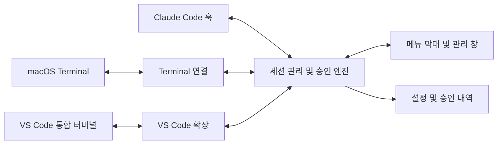

# AutoApprove 설계

상태: 0.1 연결 시제품 구현. 실제 CLI × 터미널 네 조합의 승인 동작 검증은 남아 있음.
작성일: 2026-09-21.

### Finder에서 설치 · 0.2.25

설치의 목적은 터미널 명령 없이 앱을 설치하고 여는 것이다. 기본 배포물은 macOS Installer에서 여는 `.pkg`이며, DMG에는 설치 패키지와 짧은 안내만 둔다. 흐름은 패키지 더블클릭 → 소개 → 설치 → 시스템 인증 → 진행 → 완료다. 서명·공증이 없어 최초 실행이 차단되면 시스템 설정의 해당 패키지 ‘그래도 열기’를 안내한다. 이 승인을 자동으로 없앤다고 표현하지 않는다.

시스템 설치 창의 단계 목록·버튼·진행 표시·암호 창·오류 및 완료 상태를 그대로 사용한다. 새 색상이나 컴포넌트 체계를 만들지 않는다. 소개와 완료 본문만 시스템 글꼴, 짧은 제목과 왼쪽 정렬 문단으로 구성한다. 본문 14pt, 제목 21pt, 문단 간 16pt를 기준으로 설치 창의 본문 영역에서 자연스럽게 줄바꿈한다. 사용자 데이터 보존과 실행 중인 앱 종료를 설치 전에 알린다. 암호는 시스템 인증 창이 받는다. 설치한 앱은 현재 로그인한 사용자의 권한으로 열며, 실패하면 응용 프로그램에서 여는 경로를 완료 안내에 남긴다.

기능 검증은 고정 설치 위치·다른 앱/심볼릭 링크 거부·실행 중 앱 보호·설치된 앱의 서명·해당 앱에만 quarantine 제거·일반 사용자 실행을 포함한다. 시각 검증은 실제 Installer의 소개·설치 확인·취소 및 실행 중 앱 안내에서 한글 줄바꿈, 단계와 주 동작의 식별, 키보드 동작을 확인한다. 표준 macOS 설치 창이므로 웹/모바일 반응형 UI는 만들지 않는다. 관리자 암호 입력과 실제 시스템 설치를 수행했는지는 별도 기록한다.

### 터미널 표시 이름 · 메모 · 식별 색상

기존 목록/상세 구조와 macOS 시스템 글꼴·SF Symbols·24pt 여백을 유지한다. 프로젝트명 아래의 터미널 제목은 사용자가 지정한 표시 이름을 우선하고, 원래 제목은 상세에서 계속 확인한다. 목록에는 선택한 색상의 작은 태그와 메모 한 줄만 추가한다. 상세에는 메모 전문과 ‘표시 편집’ 버튼을 둔다. 상태 색상과 행 선택 배경은 기존 의미를 유지한다.

상세 버튼과 단일 행 우클릭 메뉴는 같은 520pt 폭의 편집 시트를 연다. 표시 이름, 여러 줄 메모, 이름과 선택 표시가 있는 7색+없음 선택, 초기화·취소·저장 순으로 배치한다. 한 세션의 초안을 독립적으로 유지하며 새로고침으로 덮어쓰지 않는다. 이름 80자·메모 2,000자 한도를 알리고, 저장 실패 시 오류와 초안을 유지한다. 초기화도 저장을 눌러야 적용한다. 빈 제목은 실제 터미널 제목으로 되돌리고, 빈 메모는 목록에서 공간을 차지하지 않는다.

세션의 PID·시작 시각을 포함하는 기존 ID에 별도 표시 설정을 저장한다. 같은 세션은 앱 재실행·폴더/실제 제목 갱신 후에도 유지하고, 다른 실행 세션이나 같은 프로젝트의 다른 터미널에는 상속하지 않는다. 표시 설정은 Terminal·VS Code 자체의 탭 제목과 승인 설정을 바꾸지 않는다. 이름·메모·원래 제목은 모두 검색 대상이다.

완료 기준: 이름·여러 줄 메모·색상 저장 및 초기화, 취소·저장 실패·세션 종료·한도 초과, 기존 검색·행 선택·우클릭·더블클릭 유지, 새로고침·재실행 복원과 세션 분리를 확인한다. 실제 격리 앱의 1040×700 및 784×612에서 기본/긴 이름·긴 메모·선택/비선택·무색/색상 상태, 편집 시트의 키보드 포커스와 줄바꿈을 검증한다.

### Terminal 기본 배지 연동 · 확정 요구사항, 미구현

사용자가 지정한 알림 원본은 Terminal 앱의 탭과 Dock 아이콘에 표시되는 기본 벨 알림이다. 이 알림이 발생한 정확한 세션에 AutoApprove 배지를 표시하고, AutoApprove의 활성 관리 창에서 해당 세션을 선택해 상세를 열람하면 앱 안의 배지를 읽음 처리한다. 표시 이름은 AutoApprove 안에서만 변경한다. 아래 0.2.18의 질문·작업 완료 기반 배지는 이 원본 연동 요구사항을 충족한 것으로 보지 않는다.

[Apple의 Terminal 고급 설정 안내](https://support.apple.com/en-lamr/guide/terminal/trmladvn/mac)에 따르면 Dock 숫자는 벨 문자(Control-G 또는 `\a`)를 받은 백그라운드 세션의 수다. 전체 숫자만으로 어느 TTY에서 발생했는지 추정하지 않는다. 원본의 새 알림을 같은 실행 ID에 연결하고, 같은 원본 상태를 반복 관찰해도 이미 읽은 배지가 다시 생기지 않아야 한다. 원본을 읽을 수 없거나 세션을 확정할 수 없는 경우에는 알림 없음으로 취급하거나 다른 세션에 대신 표시하지 않는다. 읽음 처리는 기존 질문이나 자동 승인 설정을 바꾸지 않는다.

2026-09-22 확인 범위: macOS 26.4의 `Terminal.sdef`에는 TTY·화면·제목·선택 상태가 있지만 세션별 벨/배지 상태 속성은 없다. 현재 `TerminalAdapter`의 스크립트 연결만으로 이 원본 상태를 얻는 경로는 확인하지 못했다. 접근성 경로의 지원 여부는 아직 검증하지 못했으며, 현재 Computer Use가 `com.apple.Terminal` 접근을 차단해 실제 UI 검증도 진행하지 못했다. 연결 구현과 배포는 미완료다.

남은 완료 기준: 같은 제목의 여러 탭과 창에서 원본 알림을 정확한 TTY·실행 ID에 연결, 배지 발생·반복 조회·상세 열람·다음 알림·재실행 시 읽음 상태 유지, 원본 조회 실패·탭 종료·TTY 재사용 시 오표시 방지. 실제 Terminal 기본 배지와 AutoApprove 행을 함께 대조한 뒤 완료로 판단한다.

### Claude 메인·백그라운드 통합 · 0.2.19

사용자는 하나의 Claude 화면을 하나의 세션으로 관리한다. 실행 관계가 확인된 백그라운드 세션은 메인 행에 합치며 메인의 이름·메모·색상·정렬·자동 승인 설정을 사용한다. 질문·알림·승인 내역은 메인 상세에 모으고, 여러 질문은 각각 보존한다. 기존 시스템 글꼴, SF Symbols, 24pt 여백, 구분선, 상태 색상과 세로 스크롤을 유지한다. 상세의 현재 요청 영역에서 백그라운드 질문도 읽고 같은 ‘터미널에서 답하기’로 메인 화면을 연다. 별도 자식 스위치나 중복 목록 행을 만들지 않는다.

연결 근거는 다른 PTY를 만든 Claude의 실제 프로세스 조상 또는 실행 중인 Claude 등록 정보의 `parkedJobId`와 `jobId` 일치다. PID·시작 시각을 검증하고 프로젝트·제목만으로 연결하지 않는다. 확인한 관계는 정확한 실행 ID로 저장한다. 부모가 종료되면 자식을 별도로 표시하되 상속 자동 승인은 중단하고, 다시 켜는 명시적 조작이 있어야 독립 설정을 사용한다. 응답은 실제 자식 훅으로 반환하고 감사 기록에는 원래 TTY·PID를 보존한다. 부모 화면에 비친 자식 질문을 화면 경로로 중복 승인하지 않는다.

완료 기준: 메인 OFF/ON·전체 일시정지, 동시 질문·동일 문구·완료 알림·부모 열람 시 함께 읽음, 훅이 첫 탐색보다 먼저 도착하는 경우, 재실행·부모 종료·PID/TTY 재사용·모호한 연결·저장 실패를 검사한다. 실제 AutoApprove와 격리 네이티브 미리보기의 1040×700 및 784×612에서 통합 행, 긴 질문, 스위치, 검색, 배지 읽음과 질문 해결 후 상태를 확인한다.

0.2.20 보완: 새 훅이 없어도 확인된 현재 백그라운드 대기는 메인 행의 ‘응답 필요’와 기존 현재 요청 영역에 복원한다. 일치하는 작업·대화의 구조화된 질문을 읽지 못하면 입력 대기와 원래 터미널 안내를 표시한다. 이미 반환된 훅에는 답을 다시 보낼 수 없으므로 이번 질문은 직접 응답해야 한다는 이유를 상세 상태에 표시한다. 새 훅이 처리한 질문보다 오래된 대기 기록은 무시하고, 작업 재개·유휴 전환 시 현재 요청을 지운다. 자동 승인 설정은 변경하지 않으며 과거 질문을 재전송하지 않는다.

### 앱에서 Claude 승인 · 0.2.21

현재 요청 영역에서 질문·선택지 다음에 ‘허용’ 또는 원래 예 응답 라벨을 표시한다. 자동 승인이 꺼진 세션에는 ‘허용하고 자동 승인 켜기’를 함께 제공한다. 기존 시스템 글꼴·SF Symbols·24pt 여백·세로 스크롤을 유지하며, 긴 버튼은 좁은 창에서 세로로 배치한다. 백그라운드 질문은 메인 상세 안에서 각각 응답한다. 전체 일시정지는 명시적인 이번 응답을 막지 않으며 다음 자동 응답은 계속 정지한다.

새 헬퍼는 지원 질문의 공식 동기 훅을 최대 10분 유지한다. 요청별 ID·전체 내용 지문·원래 실행 ID를 고정하고, 짧은 폴링으로 연결 재시도와 앱 재시작 복구를 지원한다. 자동 응답은 최초 수신 5초 후이며 요청별로 별도 계산한다. 응답과 감사 내역을 함께 저장하고 정확히 같은 요청에만 재전달한다. ‘터미널에서 답하기’는 해당 훅을 반환해 원래 질문으로 넘긴다. 이미 반환된 예전 훅이나 지원하지 않는 질문에는 기존 터미널 안내를 유지한다.

검증 기준: 앱 허용→다음 질문 자동 처리, 한글/영문 예·허용·항상 허용·거부 중 일회 허용 선택, 순차 30개 질문, 동시 자식 요청 분리, 일시정지·해제·설정 변경, 요청 교체·세션 종료·대기 만료·헬퍼 중단, 전송 응답 유실·앱 재시작·동일 요청 재시도, 저장 실패 시 응답 금지. 실제 격리 네이티브 앱 1040×700 및 784×612에서 질문·긴 문구·버튼·키보드 포커스·전송 대기·성공·오류·해결 후 상태를 별도로 확인한다.

### 세션별 읽지 않은 알림 · 0.2.18 구현

새 질문·작업 완료 감지는 기존 알림 후보 판정을 공유한다. 목록 프로젝트명 옆에 종 아이콘과 읽지 않은 개수를 표시하고, 상태 색상·식별 태그와 구분한다. 최근 알림은 상세에서 읽을 수 있다. 활성 관리 창에서 단일 세션 상세를 열람하거나 원래 터미널 열기에 성공하면 해당 세션만 읽음 처리한다. 다른 창·백그라운드·편집 시트·다중 선택 상태에서는 자동으로 지우지 않는다. 읽음 처리는 질문 응답이나 자동 승인 설정을 변경하지 않는다.

읽음 기록과 최근 알림 50건은 개별 실행 ID로 저장한다. 같은 요청의 반복 조회는 새 배지를 만들지 않으며 해결 후 새 요청은 새 배지가 된다. 초기 프로세스 탐색만으로 기존 읽음 상태를 지우지 않는다. 짧은 자동 처리 대기는 제외하고 저장 실패는 표시한다. Terminal 자체 탭·Dock 배지 연동은 위 확정 요구사항으로 남아 있으며 이 구현에는 포함되지 않는다. Claude 백그라운드 실행기의 가상 TTY는 독립된 호스트 종류로 표시하고, 같은 프로젝트의 다른 탭으로 연결하지 않는다.

완료 기준: 질문/완료·반복·읽음·다음 알림·재실행·다른 세션 격리·저장 실패, 활성/비활성 창과 편집 시트 상태, 1040×700 및 784×612의 배지·태그·메모 공존을 확인한다.

### 버전 · 도움말 · 앱 메뉴

기존 macOS 시스템 글꼴·SF Symbols·24pt 여백·구분선을 유지한다. 관리 창 툴바와 메뉴 막대에서 도움말을 열며, 독립된 도움말 창의 상단에 실제 앱 번들에서 읽은 버전·빌드 번호와 버전 정보 복사를 둔다. 본문은 ‘시작하기 / 자동 응답 / 문제 해결’의 네이티브 분할 선택과 세로 스크롤로 읽는다. 기본 620×660, 최소 520×540에서 문장과 버튼이 잘리지 않아야 한다. 도움말 자체는 네트워크 없이 제공하고 외부 문서·릴리스·문제 보고 링크는 브라우저를 연다는 것을 표시한다.

앱 정보는 기본 macOS 정보 패널을 사용한다. 연결 설정은 툴바와 앱 메뉴의 ⌘,에서 같은 창을 연다. 전체 화면 전환만 있는 보기 메뉴와 파일·문서·서식 관련 빈 기능을 제거한다. 편집에는 입력·검색·복사에 필요한 기본 편집 동작을 유지하고, 윈도우에는 관리 창·승인 내역 이동과 최소화를 제공한다. 창을 모두 닫아도 메뉴 막대에서 도움말·관리 창을 다시 열 수 있어야 한다.

완료 기준: 번들 버전 일치, 정보 패널, 도움말의 세 주제·스크롤·버전 복사 성공/실패, 외부 링크, 연결 설정과 창 재열기, ⌘,·⌘O·⇧⌘H·⌘/·편집 단축키를 실제 네이티브 UI로 확인한다. 기본/최소 도움말 및 관리 창에서 줄바꿈·포커스·가독성을 별도로 검증한다. 승인 엔진이나 사용자의 자동 승인 설정을 변경하지 않는다.

### 응답 대기 5초 후 Yes 자동 응답

긍정 응답에는 Allow·Allow once·허용도 포함한다. Deny·Don't allow·거부는 부정 응답이며 Always allow·항상 허용·세션 내 허용만 있는 선택지는 자동으로 고르지 않는다. 여러 긍정 선택지가 있으면 유일한 이번 요청 허용을 선택하고 원래 라벨을 표시·기록·전송한다. Claude 질문 훅과 Codex 질문 대기열은 선택지 순서와 무관하게 일회 허용을 고르고, 화면 연결은 기존의 활성 1번 선택·권한 확인 제목·끝 안내·원문 재검증을 유지한다. 한글 정규화·단축키·추천·반복 허용 줄바꿈도 같은 판별기를 사용한다.

보완 방향: 기존 질문 편집기 안에 시스템 caption 글꼴·clock/pause SF Symbol로 상태를 표시한다. 남은 초와 보낼 답변을 한 줄에 시작하되 긴 선택지는 줄바꿈하고, 작은 기본 버튼으로 ‘자동 응답 취소’를 제공한다. 기본 1040×700, 최소 784×612 창에서 기존 목록/상세·24pt 여백·네이티브 포커스·버튼·의미별 색상을 유지한다. 정상 취소·작성·일시정지는 보조색으로 표시하고 실제 전송 오류만 주황색을 사용한다. 좁은 폭에서는 상태와 버튼을 세로로 배치한다.

답변 선택·입력·입력란 포커스는 즉시 해당 질문의 자동 응답을 취소하고 직접 답변 상태를 유지한다. 질문별 취소는 반복 조회·전체 재개 후에도 유지한다. 처음 읽은 루트 대화의 질문은 과거 기록으로 구분하고 이후 새로 발견한 질문만 자동 응답한다. 같은 문구의 미해결 질문 또는 답변 여부를 확정할 수 없는 후속 사용자 메시지는 직접 확인하도록 표시한다. 전송 전 일시정지/연결 변경으로 취소된 준비는 실제 실패와 구분해 재개 후 새 5초 예약을 허용하며, 이미 전달을 시도한 응답은 재전송하지 않는다.

완료 기준: 작성·선택·개별 취소·전체 일시정지/재개·과거/중복/후속 메시지·전송 오류·성공 상태를 검사하고, 실제 격리 앱의 기본/최소 창에서 긴 질문·선택지·상태 줄과 키보드/마우스 조작을 확인한다.

자동 승인이 켜진 연결 세션의 Codex 질문 대기열에서 새 예·아니오 확인을 감지하면 질문별로 5초를 기다린 뒤 기존 질문 응답 경로로 원래 Yes 라벨을 보낸다. 반복 허가 선택지는 기존 판별기를 재사용해 이번 요청만 허용하며, 작업·환경 선택 질문에는 답하지 않는다. 질문 목록의 반복 조회는 시간을 초기화하지 않고, 다른 질문은 독립된 타이머를 갖는다. 복원된 미응답 질문은 직접 확인한다.

수동 답변·정리·내용 변경·조회 실패·연결 해제·종료·일시정지·자동 승인 끄기는 예약을 취소한다. 비동기 전송 준비 후에도 같은 질문과 자동 승인 설정을 확인한다. 오래된 준비 결과는 바뀐 질문의 응답 상태를 덮어쓰지 않는다. 기존 감사 기록·전송 예약을 공유해 중복 전송과 앱 재실행 후 재전송을 방지하고, 실패·접수 결과 미확인은 직접 확인하도록 유지한다.

검증 기준: 실제 5초 지연, 반복 조회·질문별 시간 분리, 취소·재개, 수동 응답 우선, 준비 도중 일시정지·해제·질문 변경, 저장 실패, 중복·재실행 방지. 격리된 질문과 전송 대역을 사용하며 사용자 세션에는 시험 답변을 보내지 않는다.

### Codex 연속 승인 요청

0.2.14는 화면 조회 사이에 Codex가 다음 권한 요청으로 넘어가는 경우를 처리한다. 기존에는 프로세스의 화면 세대가 같으면 명령이 바뀌어도 이전 `attempted`와 재시도 한도를 이어받아 새 요청을 계속 대기시켰다. Codex는 승인 제목부터 선택지 직전까지의 전체 요청 내용으로 중복 방지용 식별자를 만들고, 내용이 다른 다음 요청에는 새 전송 상태를 사용한다. 요약의 4,000자 제한은 이 식별자에 적용하지 않는다.

줄바꿈·공백·선택지 단축키·이전 출력만 바뀌는 경우는 재전송하지 않는다. 공백을 제외한 식별자는 중복 억제와 요청 상태 추적에만 사용하며 실제 전송 전 원문 비교는 유지한다. 중간 상태 없이 내용까지 같은 요청이 반복된 경우는 화면만으로 새 요청이라고 추정하지 않는다. 늦은 이전 응답이나 시간 초과는 전송 ID와 요청 식별자를 함께 확인해 다음 요청에 영향을 주지 않는다. 이 수정은 Codex 화면 연결에 적용하며 Claude 훅 설치 여부에 의존하지 않는다.

검증 기준: 배포된 0.2.13에서 Codex 전용 fixture의 첫 승인 직후 두 번째 승인 누락 재현, 수정본의 연속 처리·각 요청 1회 전송·다른 터미널 분리·일시정지·일반 질문·늦은 응답·요청별 재시도 한도 확인. 캡처의 실제 3지 문구를 감지와 Terminal 최종 원문 검증에 사용한다. 사용자 Terminal에 시험 입력을 보내지 않는다.

### 백그라운드 모니터링·승인 대기 복구

0.2.13은 기존 대기 상태에 `대기 중 · 모니터링`을 추가한다. 다음 지시를 받을 준비가 된 CLI에 백그라운드 작업만 남거나 Claude의 종료 훅이 백그라운드·예약 작업을 보고하면 기존 초록색 상태와 안테나 SF Symbol을 사용한다. 대기 필터와 대기 수에 포함하고 툴팁·상세에 의미를 설명한다. 실제 작업 중단 안내·입력 중·질문·연결 끊김은 모니터링 대기로 처리하지 않는다. 배경 출력 변화만으로 준비 상태의 확인 시간을 초기화하지 않으며 완료 알림은 기존 완료 이벤트 판정을 유지한다.

3지 승인 화면은 마지막 No 항목과 키 안내의 줄바꿈까지 읽되, 안내 뒤 다른 출력이나 새 입력창은 승인 대상으로 보지 않는다. VS Code 전달 응답에는 8초 제한을 두고 시간 초과를 같은 감사 기록에 남긴다. 입력 전달 이후 같은 요청이 계속 관찰되는 경우도 알림 대상으로 전환한다. 늦은 결과는 다른 요청·세대·후속 작업을 덮어쓰지 않으며 전달 여부가 불명확한 입력을 재전송하지 않는다.

검증 기준: 두 도구의 줄바꿈·현재 선택·일반 작업 질문 구분, 확인 응답 누락·반복 표시·늦은 응답·새 작업의 분리, 모니터링/일반 대기/작업/연결 해제·종료 전환, 실제 1040×700 및 784×612 창의 행·상세·필터·개수. 구형 macOS에서 재현하지 않은 원인을 OS 결함으로 단정하지 않는다.

### 승인 선택지 변형·툴팁

0.2.12는 Claude Code·Codex의 활성 승인 화면과 Claude의 단일 훅 질문에서 선택지 수 대신 내용을 판별한다. 일반 Yes와 반복 승인 범위만 다른 Yes 변형, No가 함께 있으면 유일한 일회 승인 답을 우선한다. 다시 묻지 않기·세션 내 허용·영문 곡선 따옴표·한글 정규화·단축키·추천 표시와 좁은 터미널의 줄바꿈을 처리한다. 서로 다른 작업이나 모호한 선택지는 수동 응답으로 유지한다. 화면 입력은 기존의 제목·현재 선택·끝 안내·대상 프로세스·원문 재검증을 유지하며, 선택된 1번 일회 승인에만 입력한다. 과거 Codex 비동기 질문을 자동으로 재실행하지 않는다.

툴팁은 기존 SwiftUI `.help`와 AppKit 버튼 도움말을 사용한다. 관리 창·질문 대기열·승인 내역·연결 설정·메뉴의 버튼과 상태 아이콘에 동작 또는 의미를 설명한다. 체크박스 선택/해제, 빈 답변, 전송 중, 연결 필요, 목록 첫·마지막 행의 비활성 상태에 맞춰 문구를 바꾼다. 기존 배치·서체·SF Symbols·키보드 조작을 유지하고 중요한 오류와 자동 승인 범위는 본문에도 표시한다.

검증 기준: 두 도구의 3·4개 승인 선택지와 일반/곡선 따옴표·줄바꿈, 원래 답 라벨·기록 보존, 중복 이벤트·일시정지·오해 가능한 대안 구분. 실제 네이티브 기본/최소 창에서 질문 선택·입력·상태 변화, 설정·내역 화면과 툴팁의 접근성 Help 연결을 확인한다.

### 터미널 목록 순서

0.2.11은 기존 네이티브 List의 행 드래그로 순서를 바꾼다. 행의 선택·더블클릭·스위치를 유지하고 드롭 위치는 시스템 표시를 사용한다. 하단 보조 문구로 드래그를 안내하며, 우클릭의 위·아래 이동은 처음·마지막 행에서 해당 방향을 비활성화한다. 검색·필터에서는 보이는 행이 차지한 자리만 재배치해 숨겨진 행의 위치를 보존한다.

개별 세션 ID의 순서를 기존 로컬 설정 저장소에 먼저 저장한 뒤 화면에 반영한다. 새로고침·앱 재실행에서도 유지하며, 저장된 순서가 없는 새 세션은 뒤에 표시한다. 같은 프로젝트의 여러 터미널을 합치지 않는다. 이동 중 종료·목록 변경으로 원래 행을 식별할 수 없거나 저장에 실패하면 순서를 바꾸지 않고 기존 오류 안내를 표시한다.

검증 기준: 위·아래·끝 이동, 여러 행 이동, 검색·필터의 숨은 항목 보존, 새 세션·종료·폴더 변경, 재실행 복원, 저장 실패 시 원래 순서 유지. 기본/최소 관리 창에서 실제 드래그·선택 유지·드롭 이후 정확한 더블클릭·스위치·우클릭 이동을 확인한다.

### 현재 폴더의 Git 브랜치

0.2.10은 목록의 터미널 제목 다음 줄과 상세의 폴더 경로 아래에 Git 브랜치를 표시한다. 기존 보조색·작은 고정폭 글꼴과 분기 아이콘을 사용한다. 목록은 한 줄 가운데 생략, 툴팁·상세는 전체 이름을 제공하며 상세 텍스트를 선택·복사할 수 있다. 브랜치명과 detached HEAD의 커밋 해시도 검색 대상이다. 최초 조회·폴더 미확인·Git 저장소 아님·읽기 실패를 각각 표시하고 실패는 다음 갱신에서 재시도한다.

실행 중인 에이전트의 현재 폴더를 다시 확인하고, Git이 해당 폴더의 HEAD를 해석하게 하여 하위 폴더와 연결된 워크트리를 지원한다. 승인 처리와 독립된 배경 작업에서 같은 폴더를 묶어 최대 네 개씩 읽는다. 조회 후 폴더가 바뀌거나 세션이 종료되면 이전 결과를 적용하지 않는다. Git 브랜치 확인은 인덱스 갱신·체크아웃·네트워크 요청을 하지 않는다.

검증 기준: 최초 커밋 전 브랜치, 하위 폴더, 연결된 워크트리, 브랜치 전환 자동 반영, detached HEAD, 비저장소, 상속된 Git 환경 격리, 늦게 도착한 결과 배제. 실제 앱의 기본/최소 784×612 창에서 긴 이름·조회 중·실패·선택 상태, 브랜치 검색과 기존 더블클릭 동작을 확인한다.

### 작업 완료 알림

0.2.8은 기존 macOS 질문 알림 흐름에 최종 응답 완료를 추가한다. 프로젝트명과 ‘작업 완료’, 도구명, 최종 응답 요약 순서로 표시하며 기존 알림 권한·소리 설정과 정확한 터미널 이동·강조 경로를 재사용한다. 연결 설정의 알림 안내를 확장하고 Codex 완료 기록 오류는 해당 세션 상태 아래에 표시한다. 별도 알림 디자인이나 자동 승인 설정은 만들지 않는다.

Claude는 작업 시작/진행을 관찰한 뒤 루트 Stop을 받았을 때, Codex는 최초 읽기 기준선 이후 유일한 루트 대화의 최신 턴이 completed로 바뀌었을 때 후보를 만든다. Claude의 미응답 질문·보고된 백그라운드 작업·예약된 후속 작업, Codex의 failed/interrupted, 과거 기록·단순 idle·프로세스 종료는 제외한다. 완료는 최종 응답의 종료이며 의미상 목표 달성이나 모든 명령의 성공을 단정하지 않는다. 3초 확인 중 작업 재개 시 취소하며 동일 완료는 한 번만 전송한다. 자동 승인 일시정지와 무관하게 동작하고 새 작업·종료·5분 만료 시 정리한다.

검증 기준: 두 도구의 최종 완료·중복·새 작업·초기 대기·실패/중단·하위 작업 구분, 백그라운드·예약 작업·미응답 질문 보존, 기존 질문 알림과의 공존, 격리 앱의 실제 macOS 알림 전달·재개 시 제거, 기존 600×660 설정과 최소 관리 창의 안내 줄바꿈. 사용자 터미널에 검증 입력을 보내지 않는다.

### Codex 질문 대기열 · 터미널 제목 · 승인 상세

0.2.7 응답 흐름: 대기 질문 안에서 선택지를 체크하거나 직접 입력하고 ‘답변 보내기’를 누른다. 여러 선택과 덧붙인 설명은 원문 라벨 그대로 한 답변으로 조합한다. 선택만으로 전송하지 않는다. 전송 전 프로세스·대화·질문을 다시 검증하고 답변을 기록한 뒤 해당 Codex 실행 파일의 `queue --thread … --message …`를 호출한다. shell 문자열을 만들지 않는다. 접수된 답변은 ‘전달 대기’로 표시하고 승인 내역에 보존한다. 실패·결과 미확인·세션 종료를 구분하며 결과가 불명확한 전송을 반복하지 않는다. 읽기 오류·지원하지 않는 승인 화면·Claude의 반환된 질문에는 해당 위치에서 ‘터미널에서 답하기’를 제공한다. 목록과 알림에서 전송 중/접수된 질문은 추가 응답을 요구하지 않는다. 답변 입력은 반복 갱신에도 보존하고 빈 답변·중복 클릭을 막는다. 실제 Codex CLI의 격리된 큐 등록, 정확한 문자열·감사 기록·재시작 중복 방지와 기본/최소 창의 체크박스·직접 입력·전송 결과를 검증한다.

작업 상태와 미응답 질문은 동시에 유지한다. 실행 중인 Codex 프로세스가 열어 둔 유일한 루트 세션 기록을 읽기 전용으로 연결하고, 구조화된 비동기 질문을 질문별 ID로 수집한다. 일반 입력·작업 재개·도구 완료로 질문을 지우지 않는다. 정확한 질문을 인용한 답변이 유일하게 매칭되면 해당 질문만 해제한다. 로컬 기록에 권위 있는 해결 상태가 없으므로 모호한 답변은 추정하지 않으며, ‘확인 완료’는 AutoApprove 목록만 정리한다. 읽기 실패에는 마지막 목록과 오류를 함께 표시한다.

목록에는 프로젝트명 다음 줄에 터미널 제목, 별도 줄에 질문 대기 건수를 표시한다. 상세는 작업 상태 다음에 질문 대기열을 두고 기존 시스템 글꼴·구분선·주황색 응답 상태를 재사용한다. 대기열은 ‘확인 필요’ 필터와 메뉴 막대 개수, 질문별 중복 방지 알림에 포함한다. Terminal 탭의 사용자 지정 제목을 우선하며 창 제목은 해당 창의 선택된 탭에만 사용한다. VS Code는 확장이 보낸 터미널 이름을 표시한다. 제목은 한 줄로 줄이고 툴팁·상세에서는 전체를 읽을 수 있다.

최근 승인 내역은 결과·시각·두 줄 요약을 먼저 보여준다. 결과 행을 누르면 전체 요청·전달한 답변·출처를 그 자리에서 펼치고 다시 누르면 접는다. 각 항목은 독립적으로 열린다. 기존 승인 내역 창도 유지한다.

검증 기준: 동시 질문·부분 답변·동일 문구 모호성·세션 종료·재실행·읽기 실패·정리 유지, 실제 프로세스와 루트 세션의 정확한 연결, 제목 읽기 실패 시 승인 연결 보존, 기본/최소 창의 긴 제목·여러 질문·전체 요청 및 키보드 접기/펼치기. 실제 터미널 접근 제한은 검증 결과에 명시한다.

### 앱 아이콘과 도움말

앱 아이콘은 짙은 남색 터미널 타일 위에 흰 프롬프트와 민트 체크를 배치한다. 작은 Dock/Finder 크기에서도 두 기호가 분명하도록 굵은 획과 충분한 여백을 사용한다. 원본 PNG에서 16–1024px 표현을 만들어 ICNS로 앱 번들에 포함한다. 앱 내부는 기존 SF Symbols와 시스템 색상을 유지한다.

버튼·검색·필터·연결 상태·자동 승인 스위치·승인 결과에 macOS 기본 툴팁을 제공한다. 단순한 이름 반복 대신 동작 범위와 비활성 이유를 설명하며, 일시정지·연결 중·복사 완료에서는 현재 상태에 맞는 내용을 표시한다. 중요한 자동 승인 범위와 오류 안내는 화면 본문에도 유지한다. 기존 1040×700/최소 784×612 레이아웃과 키보드 조작을 보존한다.

### Claude 예·아니오 확인과 응답 알림

자동 승인을 켠 세션에서 Claude 훅이 보내는 단일 예·아니오 확인에는 ‘예’ 선택지를 전달한다. 질문의 표현을 제한하지 않고 두 선택지의 명확한 예·아니오 표시를 확인한다. 선택지 순서에 의존하지 않으며 원래 질문과 선택지 문자열을 보존한다. 여러 질문, 다중 선택, 세 가지 이상의 선택지, 프로젝트·환경·계획의 대안 선택, 이미 답이 있는 요청은 이 규칙의 대상이 아니다. `PreToolUse`의 `updatedInput.answers`와 `PermissionRequest`의 대응 응답을 사용하고 같은 `tool_use_id`에는 중복 응답하지 않는다. 응답 전에 질문·선택한 답·프로젝트를 저장하며 저장 실패 시 전달을 중단한다. 이미 훅에서 반환된 질문을 과거 기록으로 재생하지 않는다.

자동 처리할 수 없는 질문과 수동 확인이 필요한 권한 요청은 macOS 알림으로 프로젝트·도구·질문을 알린다. 앱이 앞에 있어도 배너를 표시하며 소리·배너·집중 모드는 시스템 설정을 따른다. 알림 본문 또는 ‘터미널 열기’를 누르면 원래 세션 ID로 현재 연결을 다시 확인한 뒤 기존 터미널 열기·강조 경로를 사용한다. 같은 경로나 재사용된 TTY의 다른 세션으로 대신 이동하지 않는다. 종료·연결 실패는 구체적 오류로 표시한다.

같은 질문의 반복 훅·화면 관찰은 한 번만 알린다. 새로운 도구 요청이나 해결 후 다시 나온 질문은 새 알림을 받는다. 해결·종료된 알림은 정리한다. 자동 처리 중인 잠깐의 승인 대기나 일반 입력창 타이핑은 알리지 않는다. Claude의 일반 권한·대기 알림은 미응답 질문과 선택지를 덮어쓰지 않는다.

0.2.22에서는 Claude의 열린 승인 훅과 Codex 질문 대기열의 5초 자동 응답 예약도 이 규칙에 포함한다. 배너·소리·새 배지·메뉴 막대 응답 필요 개수는 같은 수동 확인 판정을 사용한다. 상세의 질문·카운트다운·직접 응답 버튼은 유지한다. 부모 설정을 상속한 백그라운드 질문에도 적용하며, OFF·일시정지·자동 처리 불가·터미널로 넘긴 요청은 알림 대상이다. 배지와 상세는 즉시 확인할 수 있지만, 배너·소리는 질문이 10초 동안 미응답 상태를 유지한 경우에만 한 번 보낸다. 그 전에 해결·열람·자동 응답 재개하면 예약을 취소한다. 작업 완료는 기존 3초 확인 지연을 유지한다. 같은 부모의 수동 질문과 완료 알림을 자동 응답 중인 형제 요청 때문에 숨기지 않는다.

질문 대기 시간은 기본 10초이며 연결 설정의 기존 알림 영역에서 1~3600초로 직접 입력하고 ‘적용’한다. 네이티브 텍스트 필드·버튼·600×660 스크롤 창을 사용한다. 기본 상태에는 현재 저장값을 표시하고, 빈 값·범위 밖·비숫자에는 적용을 막으며 저장 실패는 입력값을 보존한 채 해당 위치에 알린다. Return으로도 적용할 수 있다. 설정은 SQLite에 먼저 저장한 뒤 반영하며 재실행 후 복원한다. 이미 기다리는 질문의 경과 시간은 초기화하지 않고, 이미 보낸 알림을 다시 보내지 않는다. 완료 알림과 5초 자동 응답 시간은 이 설정으로 바뀌지 않는다. 검증은 기본값·변경·경계·손상값 복구·저장 실패·재실행, 알림 전 질문 해결·긴 대기·중복·완료, 설정 창의 기본·오류·저장 상태를 포함한다.

Codex 도구 승인의 `Allow / Allow for this session / Always allow / Cancel`은 첫 번째 일회 허용으로 처리한다. 알려진 네 설명의 전체 문구만 라벨과 분리하며 임의의 설명을 잘라 승인으로 추측하지 않는다. `Allow preview`와 같은 제목은 이 네 선택지가 모두 확인될 때만 승인 제목으로 취급한다. 활성 선택·키 안내·원래 요청 전체의 최종 검증을 유지하고 다른 작업 선택지·변경된 요청·완료 후 출력은 입력하지 않는다.

기존 연결 설정에 ‘응답 알림’ 영역을 추가해 권한 확인·허용·시스템 설정 이동을 제공한다. 권한 거부·알림 전송 오류는 관리 창에서도 표시한다. 완료 기준은 예·아니오 변형과 사용자 제공 삼지선다의 구분, 중복·해결·다시 질문·일시정지·종료 세션 검증, 검증용 macOS 알림 클릭→창 이동→기존 강조 표시, 기본/최소 창에서 설정과 안내 문구 확인이다.

### 전체 승인 내역

관리 창 툴바·세션 상세·메뉴 막대에서 별도 `승인 내역` 창을 연다. 기존 네이티브 목록/상세 분할 구성을 재사용한다. 왼쪽은 프로젝트·처리 결과·정확한 시각·요청 요약, 오른쪽은 프로젝트 경로·도구·TTY·PID·전체 저장 요청·전달 결과를 표시한다. 검색과 결과 필터, 100건 단위 페이지 이동을 제공하며 긴 요청은 상세에서 스크롤·선택·복사한다.

기록은 프로세스 종료와 앱 재실행 이후에도 유지한다. 보관 건수 때문에 자동 삭제하지 않는다. 화면 입력 전 시도를 먼저 저장하고 결과를 같은 기록에 갱신한다. 저장 실패·조회 실패·내역 없음·검색 없음·불러오는 중·결과 미확인·복사 완료를 구분한다. 이전 기록에 없던 프로젝트 정보를 추정해 채우지 않는다. 승인 전달과 실제 명령 실행 성공은 구분한다. 기본 1040×700, 최소 784×612 및 긴 요청·100건 초과의 검증 데이터로 기능/시각 검증을 수행한다.

### 터미널 열기 위치 강조

많은 창 중 방금 연 터미널을 찾을 수 있도록 Terminal의 대상 탭을 선택하고 최소화된 창을 복원한 뒤, 해당 창 둘레에 시스템 파란색 5pt 테두리와 프로젝트명·도구·TTY 표시를 3초간 띄운다. 네이티브 시스템 글꼴과 SF Symbols를 사용한다. 표시창은 클릭·키보드 포커스를 받지 않으며 다음 열기 동작은 이전 표시를 교체한다. 다른 앱으로 이동하면 표시를 닫고, 동작 줄이기 설정에서는 퇴장 애니메이션을 생략한다. VS Code는 선택한 터미널에 이름·TTY 알림과 임시 상태 표시를 제공한다.

완료 기준: 정확한 TTY의 창만 반환, 최소화 복원, 닫힌 탭 처리, 기본·작은 창과 긴 이름에서 표식이 잘리지 않음, 표시 중 입력 가능, 3초 뒤 제거 및 연속 호출 교체. Terminal 접근 제한이 있는 환경에서는 실제 고유 창 이동과 네이티브 표식 검증을 구분해 기록한다.

### 요청 감지·연결 복구 수정

기존 SwiftUI 분할 화면·상태 색상을 유지한다. 자동 승인이 켜졌지만 연결이 없는 세션은 상단 안내와 행의 `연결 필요 · 자동 승인 대기`로 표시하고 기존 연결 설정으로 안내한다. 설정에는 Terminal 연결이 재실행 후 복원됨을 설명한다. 질문은 `응답 필요`와 질문·선택지로 표시하며 권한 요청과 구분한다.

완료 기준: 명시적으로 켠 Terminal 연결만 재실행 후 복원, 명시적 해제·권한 거부 존중, 긴 승인 요청 감지, 명령·선택지 재검증, 입력 미전달 확인 시에만 제한적 재시도, Claude 질문 내용 보존, 반환된 훅 권한 요청의 연결 화면 처리. 기본 1040×700 및 최소 784×612에서 연결 안내·행·설정 시트를 실제 앱으로 확인한다.

### 대기 노드 표시 확장

사용자는 실행 중인 Claude Code·Codex 가운데 새 지시를 기다리는 세션을 찾는다. 목록과 모든 상태 개수는 두 도구가 실행된 터미널만 포함한다. 일반 셸이나 다른 명령만 실행된 터미널은 표시하지 않는다. 기존 네이티브 분할 화면과 상태 색상, `대기 중 N개` 바로가기와 필터를 유지한다. 상세에는 대기 감지 이후의 시간과 판정 근거를 표시한다.

대기 판정은 Claude 훅의 종료·새 입력 이벤트 또는 CLI의 입력창·작업 표시를 사용한다. 화면 기반 대기는 같은 입력 대기 화면을 2초 이상 다시 확인한 후 표시한다. 출력 정지나 낮은 CPU 사용량만으로 대기를 판정하지 않는다. 화면을 읽지 못하거나 형식을 모르면 `상태 미확인`을 유지한다.

완료 기준: Terminal/VS Code에서 실행 중인 Claude Code·Codex만 목록에 나타남, 작업 중인 세션과 다음 입력을 기다리는 세션을 구분함, 일반 셸은 목록·대기 수·작업 중 수에서 제외됨, CLI 종료 시 활성 목록에서 사라짐, 새 작업·연결 해제 시 오래된 대기 상태가 해제됨. 기본 1040×700 및 최소 784×612 창에서 목록·검색·빈 필터·선택을 실제 앱으로 확인한다.

현재 결과물은 SwiftUI 앱, 로컬 승인 엔진, Claude 훅 helper, VS Code 확장이다. 아래의 제품 방향을 구현했으며, 실제 구현 범위와 검증 결과는 [README.md](README.md), [VALIDATION.md](VALIDATION.md)를 기준으로 한다. 기존 Codex CLI에서 공유 app-server 소켓을 확인하지 못해 이번 버전은 터미널 화면 경로를 사용한다. 사용자 지정 이름, 버전 표시, 모호한 매칭의 수동 선택, 수동 승인 버튼은 아직 구현하지 않았다.

## 1. 만들려는 제품

macOS 기본 Terminal과 VS Code 통합 터미널에서 실행 중인 Claude Code·Codex를 한곳에서 보고, 선택한 세션의 권한 요청을 자동 승인하는 로컬 앱.

사용자는 기존 터미널에서 계속 작업한다. 앱에서는 프로젝트별 세션 상태, 자동 승인 설정, 처리 내역을 확인하고 필요한 터미널로 이동한다.

사용자가 확인한 요구사항:

- 대상 도구: Claude Code, Codex.
- 대상 터미널: macOS 기본 Terminal, VS Code 통합 터미널.
- 이미 실행 중인 세션을 관리하고 Yes를 자동으로 처리한다.

첫 버전의 범위:

- macOS 메뉴 막대 앱 + 관리 창. 계정이나 서버 운영 없이 로컬에서 동작한다.
- 자동 승인은 사용자가 켠 세션에 적용한다. 여러 세션을 선택해 한 번에 켤 수 있다.
- 기본 자동화 대상은 실행·파일 변경 등 권한 요청과 Claude 훅의 단일 예·아니오 확인이다. 작업 방향의 대안 선택은 응답 상태와 알림으로 알려준다. 자유 입력·로그인은 직접 처리한다.
- 첫 버전은 로컬 세션을 지원한다. SSH, Dev Containers, WSL 등은 후속 범위다.

## 2. 연결 구조

세션을 발견하는 기능, 승인 요청을 받는 기능, 실제로 응답하는 기능을 구분한다. 목록에 보인다는 이유만으로 자동 승인이 가능하다고 표시하지 않는다.



| 구성 | 역할 | 확인할 사항 |
|---|---|---|
| Terminal 연결 | 창·탭·TTY 식별, 화면 읽기, 대상 탭으로 이동, 필요한 경우 입력 전달 | AppleScript 사전에 관련 기능이 있음. 실행 중인 TUI에서 읽기·입력 동작은 실험 필요 |
| VS Code 확장 | 각 창의 터미널 등록, 터미널로 이동, 대상 터미널에 입력, 연결 후 실행 이벤트 수집 | 과거 출력 전체를 가져오는 것으로 설계하지 않음 |
| Claude 연결 | 세션 이벤트 수집, `PermissionRequest` 훅으로 권한 요청 수신 및 응답 | 설치된 버전의 훅 적용 시점과 기존 세션 적용 여부 확인 |
| Codex 연결 | 현재는 Terminal 또는 VS Code 화면 연결 사용 | app-server의 기존 TUI 교차 클라이언트 승인은 후속 검증 |
| 공통 엔진 | 세션 식별, 자동 승인 설정, 요청 처리, 연결 복구, 내역 기록 | 한 세션의 요청이 다른 터미널로 전달되지 않도록 식별자 유지 |

Claude는 훅 연결을 우선 사용한다. Codex 및 훅을 연결하지 않은 Claude는 지원하는 승인 화면을 감지한 뒤 해당 탭에 한 번 입력하는 어댑터를 구현했다. 화면 형식은 테스트 fixture로 검증했으며 실제 CLI 버전별 호환성 검증은 남아 있다. 자동 입력을 위해 다른 앱으로 포커스를 옮길 필요가 없도록 설계한다.

### 이미 실행 중인 세션

기존 세션 지원은 핵심 요구사항이며 첫 기술 검증 대상이다.

1. 실행 중인 프로세스와 터미널을 발견한다.
2. 실제 승인 요청 채널 및 응답 채널을 연결한다.
3. 해당 세션에 응답할 수 있는 상태가 확인되면 자동 승인 스위치를 활성화한다.
4. 연결 정보가 부족하면 `연결 필요`와 구체적인 연결 절차를 표시한다.

VS Code의 `TerminalShellExecution.read()`는 호출 이후의 데이터만 제공한다. 확장을 나중에 연결해서 이미 출력된 승인 화면을 모두 복구할 수 있다고 가정하지 않는다. 기존 세션은 도구 자체의 연결 기능을 먼저 검증한다.

Codex의 저장된 대화를 읽거나 다시 여는 것과, 실행 중인 TUI의 승인 요청을 처리하는 것은 별개의 동작이다. 후자를 검증하기 전에는 기존 세션 자동 승인 지원을 확정하지 않는다.

연결이 불가능한 조합은 대화 이어하기 또는 다음 실행부터 연결하는 보조 경로를 검토한다. 이는 기존 세션을 그대로 제어하는 것과 구분해 표시한다. 앱 전용 실행기로 전환해야만 작동하는 설계로 요구사항을 바꾸지 않는다.

## 3. 세션과 요청 처리

세션에는 다음 정보를 유지한다.

- 도구 종류, 도구의 세션 ID, 연결 세대, 확인된 버전.
- 프로젝트 경로, 사용자 지정 이름, 현재 작업 상태, 최근 이벤트 시각.
- 터미널 종류, 창·터미널 식별자, PID와 프로세스 시작 시각, 가능한 경우 TTY.
- 상태 조회·승인 응답·터미널 이동 등 현재 가능한 기능.
- 자동 승인 설정과 연결 상태.

프로젝트 경로나 PID 하나만으로 세션을 매칭하지 않는다. 같은 프로젝트에서 여러 세션을 실행하거나 프로세스 ID가 재사용되는 경우를 처리한다. 매칭이 모호하면 사용자가 연결 대상을 선택할 수 있다.

승인 요청은 `세션 ID + 연결 세대 + 요청 ID`로 관리한다. Claude 훅에 고유 요청 ID가 없으면 helper가 호출마다 새 ID를 만든다. 동일한 명령이 반복되는 정상 상황을 중복으로 제거하지 않는다.

```text
요청 수신 → 요청 종류 확인 → 현재 설정 확인 → 응답 전 연결·유효성 재확인
         → 승인 시도 저장 → 응답 전송 → 전달 결과 갱신
```

- 자동 승인 ON: 지원하는 권한 요청에 대해 이번 요청을 승인한다.
- 자동 승인 OFF: 원래 도구의 사용자 승인 흐름을 유지한다. 앱의 수동 승인 버튼은 응답 채널이 지원할 때 제공한다.
- 전체 자동 승인 일시정지: 이후 자동 응답을 중지한다. 이미 실행 중인 작업을 종료하는 버튼과 구분한다.
- 도구에 영구 허용 규칙을 추가하지 않는다. 스위치를 끄면 이후 요청부터 수동 상태로 돌아와야 한다.
- 사람이 먼저 응답했거나 요청이 취소되면 앱의 대기 항목도 해제한다.
- 응답 전송과 실제 수락을 구분한다. 확인을 받지 못하면 `처리 확인 중`으로 표시하며 입력을 반복 전송하지 않는다.
- 연결이 끊기거나 앱이 재시작되면 남은 요청의 유효성을 다시 확인한다. 이전 연결의 대기 입력은 자동 재생하지 않는다.
- 터미널 입력 방식에서는 화면 확인과 입력 사이에 상태가 바뀔 수 있다. 대상 프로세스와 화면을 다시 확인하되, 구조화된 요청과 동일한 확실성을 보장한다고 표현하지 않는다.
- 일반 로그에 나타난 `yes`, `approve`, 예시 명령만으로 자동 입력하지 않는다.

Claude의 `PermissionRequest`가 모든 종류의 확인창을 포괄한다고 가정하지 않는다. 현재 공식 문서에는 샌드박스 네트워크 요청 등의 예외가 있으므로 요청 종류별 지원표를 검증 과정에서 작성한다.

## 4. 사용 흐름과 화면

처음 실행하면 Terminal 연결과 VS Code 확장 연결을 안내하고 발견한 세션을 보여준다. 사용자는 자동화할 세션을 선택하고 자동 승인을 켠다. 이후 메뉴 막대에서 대기 여부를 확인하고 필요할 때 관리 창이나 원래 터미널을 연다.

### 메뉴 막대

- 실행 중인 세션 수와 사용자 응답이 필요한 세션 수.
- 최근 승인 내역 몇 개.
- 관리 창 열기.
- 전체 자동 승인 일시정지/재개. 현재 상태를 텍스트로 표시한다.

### 관리 창

주 화면은 세션 목록과 선택한 세션의 상세 영역으로 구성한다.

| 목록 열 | 표시 예시 |
|---|---|
| 프로젝트 / 세션 | autoapprove / UI 작업 |
| 도구 | Claude Code 또는 Codex |
| 터미널 | Terminal 또는 VS Code |
| 상태 | 작업 중 / 승인 대기 / 응답 필요 / 입력 대기 / 오류 / 종료 / 상태 미확인 |
| 자동 승인 | 켜짐 / 꺼짐 / 연결 필요 |
| 최근 활동 | 마지막 이벤트 또는 승인 시각 |

상세 영역에는 프로젝트 전체 경로, 현재 요청, 자동 승인 설정, 최근 처리 내역, `터미널 열기`를 배치한다. 자동 승인 설정을 주 동작으로 삼고, 사용자가 처리해야 할 요청은 목록 필터와 상태 표시로 찾을 수 있게 한다.

세션 행의 더블클릭과 우클릭 ‘터미널 열기’는 상세 버튼과 같은 정확한 세션 이동·강조 경로를 사용한다. [SwiftUI 목록의 기본 동작](https://developer.apple.com/documentation/swiftui/view/contextmenu(forselectiontype:menu:primaryaction:))을 사용해 단일 클릭 선택·다중 선택·자동 승인 스위치를 유지한다. 여러 세션을 선택한 상태에서도 마우스 이벤트의 행을 확인해 더블클릭한 세션만 연다. 연결 전 세션에는 기존 연결 안내를 표시하고 중복 열기 요청은 진행 중 상태에서 막는다.

작업이 끝나 다음 입력을 기다리는 상태와 프로세스가 종료된 상태를 구분한다. 출력이 잠시 없다는 이유로 완료 처리하지 않는다. 연결 상태와 작업 상태도 별도로 관리한다.

### 시각 및 상호작용 원칙

- 방향: macOS 네이티브 개발 도구. 표와 분할 화면 중심의 적당히 조밀한 구성.
- 시스템 글꼴로 일반 UI를 표시하고 경로·명령·로그에만 고정폭 글꼴을 사용한다.
- 시스템 라이트/다크 모드와 의미별 색상을 사용한다. 상태는 색상과 텍스트를 함께 표시한다.
- 본문 13–14pt, 화면 제목 약 20pt를 시작점으로 사용하되 실제 화면과 접근성 설정에서 확인한다.
- 간격은 4/8/12/16pt를 기본으로 사용한다. 네이티브 목록·토글·버튼·SF Symbols를 재사용한다.
- 기본 창 크기 약 1000×680, 최소 약 780×560. 좁은 창에서는 보조 열을 줄이고 상세 화면을 전환해 보여준다.
- 긴 프로젝트 경로는 축약 표시와 전체 보기·복사를 함께 제공한다. 명령문은 줄바꿈하고 로그만 별도 스크롤한다.
- 키보드 이동, 포커스 표시, 선택 상태, hover, disabled 이유를 제공한다. VoiceOver에 상태·토글 이름을 전달한다.
- 연결 중, 세션 없음, 권한 거부, 확장 미연결, 끊김, 재연결, 승인 성공·실패 상태를 설계한다.
- 상태 변경에만 짧은 전환을 사용하고 Reduce Motion 설정을 따른다.
- 큰 장식 카드, 지표만 있는 대시보드, 지속 점멸, 로그 도착마다 목록 순서를 바꾸는 동작은 사용하지 않는다.

## 5. 기술 구성

현재 구현은 다음 구성을 사용한다.

| 부분 | 제안 | 이유 |
|---|---|---|
| 메뉴 막대·관리 창 | SwiftUI, 필요한 부분에 AppKit | macOS 창·메뉴·알림과 자연스럽게 연결 |
| 세션·승인 엔진 | Swift의 별도 모듈 및 actor | UI와 독립적으로 요청의 순서와 상태 관리 |
| Claude 훅 helper | 작은 CLI 실행 파일 | JSON 입력을 로컬 엔진에 전달하고 이번 요청의 응답 반환 |
| VS Code 확장 | TypeScript | 공식 터미널 API 사용 |
| 로컬 통신 | 사용자 전용 Unix socket | helper와 확장이 동일한 앱 엔진에 연결 |
| 설정·승인 내역 | SQLite | 세션별 설정과 처리 결과의 로컬 보관 |
| Codex 연결 | Terminal 화면 / VS Code 출력 어댑터 | 기존 CLI의 공유 서버 연결이 확인되지 않아 화면 경로 사용 |

첫 버전에서는 메뉴 막대 앱 프로세스가 엔진을 유지한다. 관리 창을 닫아도 동작하고 메뉴에서 앱을 종료하면 자동 승인도 종료한다. 별도의 상시 서비스는 필요가 확인될 때 추가한다.

연결 설치기는 기존 Claude 설정을 보존해 필요한 훅만 병합하고, 중복 설치와 제거를 지원해야 한다. Terminal 자동화 권한과 VS Code 확장 연결 상태는 설정 화면에 표시한다. 첫 버전 배포 경로는 직접 설치하는 macOS 앱을 가정하고 서명·자동화 권한을 확인한다.

## 6. 구현 순서와 완료 기준

### P0: 기존 세션 연결 검증

관리 화면을 넓게 구현하기 전에 아래 네 조합을 검증한다.

- Terminal에서 이미 실행 중인 Claude Code.
- Terminal에서 이미 실행 중인 Codex.
- VS Code 통합 터미널에서 이미 실행 중인 Claude Code.
- VS Code 통합 터미널에서 이미 실행 중인 Codex.

각 조합에서 세션 발견, 정확한 대상 매칭, 승인 요청 수신, 해당 요청 응답, 원래 터미널의 작업 계속 여부를 확인한다. 연결 전부터 승인을 기다리는 경우와 연결 후 새 요청이 발생하는 경우를 모두 다룬다.

특히 Codex의 두 클라이언트 간 승인 요청 전달과 Claude 기존 세션의 훅 적용 시점을 확인한다. 기존 세션을 중단하지 않고 연결할 수 없는 경우에는 원인과 필요한 연결 절차를 기록한다. 실제 자동 승인 가능 범위를 이 결과로 확정한다.

### P1: 사용 가능한 첫 버전

- 세션 목록과 상태 표시.
- 세션별·다중 선택 자동 승인 켜기/끄기.
- 전체 자동 승인 일시정지.
- 지원하는 요청의 자동 승인 및 처리 내역.
- 원래 터미널로 이동.
- 연결 해제·복구 및 앱 재시작 처리.

### 검증 기준

- 서로 다른 세션에 승인이 섞이지 않는다. 같은 프로젝트의 여러 세션도 구분한다.
- 지원하는 요청이 자동 처리되고 원래 터미널에서 작업이 계속된다.
- 사람이 먼저 응답하거나 요청이 취소되었을 때 추가 입력하지 않는다.
- 응답 여부가 불분명한 전송을 재시도해 다음 입력창에 문자를 넣지 않는다.
- 일시정지 이후 대기 중인 승인 전달을 시작하지 않는다. 이미 전달을 시작한 입력은 취소할 수 없다.
- CLI 종료, VS Code 창 종료, Mac 잠자기·복귀, 앱 재시작을 처리한다.
- 일반 질문과 승인 문구가 포함된 로그를 권한 요청으로 오인하지 않는다.
- 목표: 로컬 승인 이벤트 수신부터 응답까지 p95 1초 이내. 실측 전 수치다.
- 목표: 세션 10개 동시 관리. UI 창이 닫혔을 때도 자동 승인이 계속된다.
- 기능 검증과 별도로 작은 창·기본 창, 라이트·다크 모드, 긴 경로, 많은 세션, 오류·끊김 화면을 실제 macOS 앱에서 확인한다.

세부 명령 규칙, 프로젝트별 기본값, 신규 세션 실행, 원격 컴퓨터 연결은 후속 기능으로 남긴다.

## 7. 확인한 근거와 남은 불확실성

- 현재 로컬 CLI 버전: Codex 0.155.1, Claude Code 2.1.92. 버전 명령으로 확인했다.
- 설치된 Codex CLI 도움말에는 `app-server`, 로컬 daemon, `agents`, `--remote`가 있다. JSON schema 생성도 확인했다. 실행 중인 세션의 승인 요청에는 아직 연결하지 않았다.
- [Codex App Server 공식 문서](https://learn.chatgpt.com/docs/app-server#approvals)는 구조화된 승인 요청과 응답, 요청 해제 알림을 설명한다. 별도 클라이언트가 기존 TUI의 요청을 처리할 수 있는지는 이 설계에서 미검증이다. 실험적 인터페이스는 버전별로 검증한다.
- [Claude Code Hooks 공식 문서](https://code.claude.com/docs/en/hooks#permissionrequest)는 권한 요청을 훅으로 승인할 수 있음을 설명한다. 최신 문서의 모든 기능이 설치된 버전에서 같다고 가정하지 않는다.
- [VS Code TerminalShellExecution API](https://code.visualstudio.com/api/references/vscode-api#TerminalShellExecution)는 `read()` 호출 이후의 출력만 읽는다고 명시한다. [Terminal API](https://code.visualstudio.com/api/references/vscode-api#Terminal)는 특정 터미널의 입력 전달과 표시 기능을 제공한다.
- 로컬 `/System/Applications/Utilities/Terminal.app/Contents/Resources/Terminal.sdef`에서 탭의 `contents`, `history`, `tty`, `processes`와 `do script`를 확인했다. 실제 탭을 읽거나 입력을 보내지는 않았다.
- UI는 `ui-design-workflow`, `ui-ux-pro-max`, `impeccable`을 참고해 SwiftUI 네이티브 목록과 분할 창으로 구현했다. 기능 테스트와 실제 앱 화면 확인 범위는 [VALIDATION.md](VALIDATION.md)에 기록한다. 성능 목표의 정량 측정은 남아 있다.
