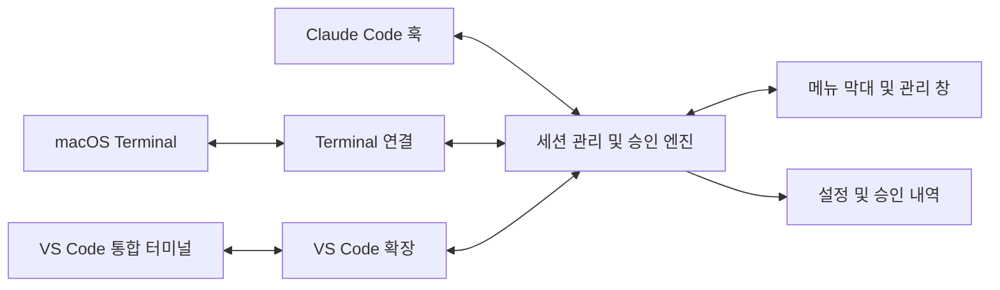

# AutoApprove 설계

원본 커서·입력 동기화 · 0.2.71: 기존 터미널 화면·시스템 글꼴·의미 색상·44px 조작부를 유지한다. Codex와 Claude의 기본 텍스트 화면은 원본 터미널이 제공한 동일 스냅샷의 표시 텍스트·커서를 사용한다. 입력 검증과 승인 감지는 기존 원문을 별도로 유지한다. 아래로 따라가기 ON에서는 여러 줄 입력과 푸터가 있어도 실제 커서를 보이게 하고, OFF·텍스트 선택·한글 조합은 사용자의 위치와 편집 상태를 유지한다. 원본 정보가 없거나 권한·세션이 바뀌면 커서를 임의로 만들어 표시하지 않는다. 완료 기준은 Mac의 입력·커서 이동→웹, 웹의 문자·방향키·삭제→같은 원본, 자동 승인 ON·작업 중 편집·한글/emoji/줄바꿈·스크롤·재연결·원본 식별 보존 및 390×844·768×1024·1440×900 기능·시각 확인이다.

다른 Mac 터미널 첫 연결 · 0.2.69 빌드 86: 기존 목록·터미널·시스템 글꼴·의미 색상·44px 조작부를 유지한다. 선택 시 처리 내역보다 터미널 연결을 먼저 시작한다. 최근 실제 관찰 화면은 원본 PID·시작 시각·TTY를 확인한 첫 연결에서만 사용하며 관찰 시각을 갱신하지 않는다. 이후 실시간 출력과 입력 전 검증은 기존 경로를 사용한다. 완료 기준은 다른 Mac 첫 화면 시간 측정, 만료·원본 교체·종료·취소 처리, 입력·초안·세션 식별 보존과 390×844·768×1024·1440×900 기능·시각 확인이다.

로컬 주소와 빠른 진입 · 0.2.64 빌드 80: 기존 Mac 연결 설정의 시스템 글꼴·세로 그룹·기본 버튼과 링크를 유지한다. 웹 접속 스위치 바로 아래에 ‘이 Mac에서 여는 주소’를 두고 주소·설정 상태·명시적 설정/확인·열기 순서로 표시한다. 관리자 승인은 macOS 기본 파일 승인으로 해당 hosts 파일에만 적용하고 기존 내용·권한을 유지한다. 미설정·설정 중·취소/실패·기존 설정 충돌·설정 완료·웹 OFF/연결 중을 구분한다. 로컬 이름은 휴대폰 공유나 다른 Mac 연결 주소에 넣지 않는다. 각 게이트웨이는 첫 HTML을 로컬에서 즉시 제공하고, 최신 웹 발견은 기존 안내와 명시적 새 탭 링크만 사용한다. 자동 HTTP/JS 이동은 하지 않으며 URL·선택 세션·초안을 유지한다. 검증은 파일 보존·원본 프로세스 보존, Mac 자신의 실제 이름/HTTP 연결, 느린 최신 Mac이 있어도 빠른 첫 페이지, native light/dark·390/768/1440 웹 렌더링이다.

상태: 0.1 연결 시제품 구현. 실제 CLI × 터미널 네 조합의 승인 동작 검증은 남아 있음.
작성일: 2026-09-21.

### 개인 핫스팟의 웹 관리 화면

Mac 버전·세션 오류 복구: 기존 시스템 글꼴·의미 색상·44px 조작부를 유지한다. 각 Mac 이름 아래 설치 버전과 빌드를 표시하고 연결이 끊겼을 때는 마지막 확인 값임을 명시한다. 버전이 없는 클라이언트는 미확인으로 표시한다. 오류로 중단된 Codex·Claude 세션은 목록과 알림에서 찾을 수 있고 원인·같은 대화의 자동 이어가기 상태·다음 시도 시각을 확인한다. 정상 종료·사용자 입력·다른 원본 작업과 오류 복구를 구분하고, 결과가 불명확한 입력은 자동으로 다시 보내지 않는다. 같은 원본의 오류에만 복구를 적용하며 웹 연결 오류만으로 CLI 입력이나 새 대화를 만들지 않는다. 완료 기준은 버전 확인·오프라인 복원, 오류와 정상 종료 구분, 알림 중복 방지, 자동 이어가기와 중지·일시정지·불명확한 전송 처리, 원본 식별 보존 및 390×844·768×1024·1440×900의 기능·시각 확인이다.

웹 콜드스타트: 첫 세션 목록은 접속한 Mac의 간결한 상태를 먼저 사용한다. 다른 Mac은 ‘세션 확인 중…’ 상태에서 이어서 확인하며 저장한 세션 링크는 해당 Mac만 우선 조회한다. 전체 승인 기록과 중복 세션은 초기 목록에 포함하지 않고 선택한 세션의 기록만 별도로 받는다. xterm·PTY 구성 요소는 사용자가 PTY를 열 때 로드한다. 최초 로드·라이브러리 실패·다시 연결·처리 내역 실패와 재조회 상태를 표시하며, 느린 Mac 한 대 때문에 첫 목록이 지연되지 않는지 별도 검사한다.

웹 메시지 전달 · 0.2.58 빌드 73: 기존 질문·메시지 창, 시스템 글꼴·의미 색상·44px 조작부를 유지한다. 기본 메시지는 선택한 원본 CLI에 보내며 대화 기록이 없는 Codex도 별도 PTY나 대화 선택 없이 같은 터미널로 전달한다. 사용자가 명시적으로 연결한 Codex 대기열은 기존 경로를 유지하고 원본 전송으로 돌아올 수 있다. 전송 상태와 초안은 세션별로 유지하며 다른 세션 선택·창 닫기·페이지 갱신에 섞이거나 사라지지 않는다. 전송 전 거부는 편집과 재시도를 허용하고, 응답 유실은 같은 요청의 접수 결과를 읽기 전용으로 확인하며 입력을 자동 재전송하지 않는다. 완료 기준은 실제 CLI의 메시지 수신, working/idle·한글/여러 줄·동시 세션·원본 식별 보존, 응답 유실 후 성공 확인·중복 입력 없음·전송 전 실패 복구와 390×844·768×1024·1440×900 기능 및 시각 검사다. Bonjour 게시를 HTTP 수신과 분리하고 수신 실패를 자동 복구해 이름 검색 오류로 메시지 서버가 종료되지 않게 한다.

마우스 활동 유지 · 0.2.57 빌드 72: 기존 Mac 연결 설정의 시스템 글꼴·스위치·상태·권한 버튼을 사용하며 잠자기 설정 다음에 독립된 ‘마우스 활동 유지’를 둔다. 기본 OFF, 명시적으로 켜면 최초 1분 후부터 작업 상태·자동 승인 일시정지·배터리·온도와 관계없이 60초 주기로 현재 커서 위치에 이동 신호만 보낸다. 클릭·키 입력·커서 이동·잠금 해제는 하지 않는다. 이미 잠긴 화면 또는 로그인 세션을 확인할 수 없는 경우에는 신호를 건너뛰고, 사용자가 직접 잠금을 해제한 뒤 다음 주기에 다시 확인한다. 설정은 재실행 후 복원하고 앱 종료·스위치 OFF는 즉시 중단한다. 권한은 명시적인 버튼으로만 요청하며, 실패·허용 대기·잠금·꺼짐·켜짐과 마지막 신호 시각을 구분한다. 완료 기준은 단일 주기·중복 요청·늦은 재개 시 몰아서 보내지 않음·잠금/권한 차단·복원 및 Mac light/dark 설정 렌더링과 실제 설치본의 신호 관찰이다. 잠자기 설정의 기존 보호 조건과 별도이며 웹 화면은 변경하지 않는다.

읽기 연결 복구 · 0.2.56 빌드 71: 본문 없는 GET의 전송 시간 초과에만 같은 경로·노드 헤더로 새 연결을 한 번 만든다. 두 시도의 합계는 기존 대기 시간과 같으며 애플리케이션 오류·권한 거부·취소·POST는 자동 재전송하지 않는다. 기존 화면·입력 초안과 마지막 관찰 시각 처리를 유지한다. 완료 기준은 응답 없는 첫 연결의 폐기와 두 번째 읽기 성공, 취소 후 추가 요청 없음, 불확실한 입력의 단일 전달, 실제 Mac 간 조회 및 같은 원본 터미널 스트림 유지다.

중계 응답·재연결 · 0.2.55 빌드 70: 기존 화면 공유 창·색상·44px 조작부를 유지한다. 일시적인 읽기 실패에는 마지막 정상 화면과 실제 관찰 시각을 표시하고 같은 공유만 재조회한다. 동시에 하나의 요청만 허용하고 재시도 간격은 0.5초부터 최대 3초로 제한한다. 닫기·숨김·공유 전환은 읽기와 타이머를 취소하며 취소를 시간 초과로 표시하지 않는다. 권한 거부·공유 만료는 이미지를 지우고 자동 재시도하지 않는다. 입력·답변·명령은 자동 재전송하지 않는다. 완료 기준은 읽기 복구·오래된 화면 표시·불필요한 오류 없음·권한 폐기와 390×844·768×1024·1440×900의 기능 및 시각 확인이다. Mac 간 전송은 확인된 물리 LAN 주소를 우선하며 일시적인 상태 조회 실패에도 유지한다. 버전/게이트웨이의 최신 확인 조건과 목적지 노드 ID 검사는 별도로 유지한다. HTTP 응답은 쓰기 종료 후 상대의 수신 완료를 기다리고 요청/최종 스트림 오류의 연결 수명은 제한한다.

보기 전용 화면 공유 · 0.2.51 빌드 62: 기존 화면 공유 창과 의미 색상·44px 조작부를 유지한다. ‘화면 공유’를 누르면 선택한 Mac 화면을 바로 보며, 확대는 휴대폰에서만 적용된다. 다른 공유 화면은 목록을 펼쳐 선택한다. 공유를 연 원본 세션에 고정한 ‘세션에 테스트 지시’로 기존 질문·메시지 창을 열고, 닫으면 같은 공유 화면으로 돌아온다. 세션 종료·선택 변경·다른 Mac의 공유에는 지시를 전달하지 않는다. 최신 Codex에서 직접 선택한 대화는 대기 입력과 새 메시지에 적용하며, 메시지를 보내기 전에 원본 프로세스·선택 대화·작업 폴더를 확인한다. 원본 터미널의 키 입력 대상은 유지한다. 완료 기준은 보기·확대의 터미널 입력 0건, 명시적 지시의 같은 세션 단일 전달, 공유 닫기/숨김의 캡처 중지와 모바일·태블릿·데스크톱 렌더링이다.

질문 전송·대기 입력·테스트 화면 · 0.2.50 빌드 61: 기존 시스템 글꼴, 의미 색상, 44px 조작부, 질문·메시지 창과 테스트 화면 창을 유지한다. 질문의 선택·추가 설명은 갱신과 실패에도 보관한다. 자동 응답 중지 요청은 해당 질문에만 연결하며 일반 전송 버튼을 막지 않는다. 제출은 편집 요청 확인 뒤 한 번만 보내고 요청 중·성공·실패·결과 미확인을 질문 안에서 표시한다. 독립적인 원본 스트림이 정상인 동안에는 Mac 목록 조회 지연만으로 같은 원본의 질문 답변을 막지 않는다.

Codex 질문 창의 기존 스크롤 영역에 실제 후속 입력 목록과 갱신·비우기를 배치한다. 비우기는 현재 목록 최대 100개에 대한 삭제 확인을 거쳐 공개 대기열 API를 호출한다. 새 입력과 실행 중인 작업은 유지하고, 삭제한 질문 답변은 취소 상태로 바꾼다. 목록 없음·조회 중·지원하지 않는 버전·연결 오류·삭제 취소·부분 삭제 오류를 표시한다. 테스트 화면 버튼은 선택한 Mac의 기존 MCP 공유를 바로 열거나 전체 디스플레이 공유를 시작하며, 명시적인 버튼·MCP 시작 이외의 경로는 캡처하지 않는다. 10분 만료, 보기 닫기·숨김의 요청 정지, 공유 종료의 접근 폐기, 권한 오류와 재시도를 유지한다. 완료 기준은 선택 응답 단일 전달·직접 키 주입 없음, 삭제 시 새 입력/원본 식별 보존, 버튼 한 번으로 화면 보기, 390×844·768×1024·1440×900 기능 및 시각 검사다.

최신 Codex가 CLI에서 기록 파일을 직접 열지 않아 원본 대화 ID를 자동으로 확인할 수 없으면, 기존 대기 입력 영역에서 ‘Codex 대화 연결’로 같은 폴더의 실행 중인 대화를 읽어 표시한다. 기존 label/select/button을 사용하고 빈 목록·조회 중·오류·미선택 비활성·명시적 연결을 제공한다. 폴더 기준으로 대화를 추측해 연결하지 않는다. 선택된 대화 이름은 대기 입력 상태에 표시하며, 조회·삭제 때 현재 원본 프로세스와 선택한 대화의 실행/폴더를 다시 확인한다. 원본 터미널 입력과 대기 입력의 대상은 분리한다.

tmux 원본 중계 · 0.2.44 빌드 55: 유료 Apple 개발자 계정 없이 각 Mac의 사용자 권한으로 tmux control mode에 연결한다. TMUX·TMUX_PANE과 실제 서버 계보를 함께 확인하고 서버 PID·시작 시각·소켓 소유자·pane ID 및 같은 CLI의 PID·시작 시각·TTY를 고정한다. 원본 ANSI 셀과 실제 커서 좌표·형태·표시·깜박임을 읽어 기존 모바일 터미널에 전달한다. pane 출력 변경은 SSE 관찰자를 깨우며 같은 프레임·읽기를 공유하고 느린 브라우저는 최신 상태를 받는다. 입력은 영구 연결의 공개 tmux 명령으로 정확한 UTF-8·제어 바이트를 보내며 새로운 ps·tmux 프로세스를 키마다 만들지 않는다. 입력 직전과 실제 전달 명령에서 복사 모드·입력 OFF·synchronize-panes를 확인해 다른 창 입력을 차단한다. 조회·재시도·해제는 새 PTY·CLI·대화·크기를 만들거나 변경하지 않는다. 기존 tmux 밖의 CLI는 그대로 유지한다.

설정은 기존 macOS 서체·의미 색상·24pt 여백·600pt 스크롤 창을 사용한다. 네트워크 설정 다음에 tmux 설치/연결 상태, 시작 명령 복사, 연결 확인/해제를 배치한다. 이미 tmux 안에서 실행 중이면 시작하지 않고 연결 확인만 안내한다. 휴대폰에는 설치하지 않는다. 누락·세션 없음·연결 중·연결됨·해제·오류, 긴 명령 줄바꿈과 light/dark 상태를 확인한다. 설치/실행 권한과 일반 출력·입력을 분리하며 선택형 Mac 창 보기는 기존 지원 호스트에서만 제공한다. 세부 구현·검증 계약은 docs/superpowers/plans/2026-10-05-tmux-relay.md에 기록한다.

원본 입력 서비스 설정 · 0.2.43 빌드 54: Terminal 직접 입력은 같은 발행자로 서명한 로컬 XPC 보조 서비스를 통해 기존 TTY에 바이트를 전달한다. 출력·커서·선택형 창 보기의 기존 범위는 유지한다. 새 설치는 봉인된 앱의 `Contents/Library/LaunchDaemons`와 앱 상대 `BundleProgram`을 `SMAppService`로 등록하며, Developer ID 서명·Apple 공증·관리자의 macOS 승인 절차를 따른다. 관리자 셸로 시스템 폴더에 파일을 복사하는 설치 경로는 사용하지 않는다. 정상 연결된 기존 서비스는 등록·종료·교체 없이 유지하고, 기존 서비스가 연결되지 않으면 자동 재설치하지 않고 이유를 표시한다. 일반 GET·SSE·입력 요청과 상태 갱신에서는 등록이나 macOS 설정 창 열기를 수행하지 않는다.

설정 UI는 기존 macOS 서체·의미 색상·600pt 설정 창을 유지한다. 미설치·등록 중·승인 대기·연결됨·오류를 구분하고 각각 직접 입력 연결·비활성 진행 표시·허용 설정 열기·연결 확인을 제공한다. 긴 승인 안내와 오류가 줄바꿈되어 읽혀야 하며 선택형 화면 공유는 별도 상태로 유지한다. 완료 기준은 정확한 바이트와 원본 식별 검사 유지, 정상 서비스의 재등록 0건, 승인 대기의 중복 등록 0건, 신뢰 조건 실패 시 등록 0건, 패키지 서명과 등록 plist 검사, 설정 light/dark 렌더링이다. 신규 서비스의 실제 등록·관리자 승인 및 EDR 판정은 공증된 설치본으로 별도 검증한다.

원본 터미널 공유 · 0.2.43 빌드 52: 기본은 같은 원본 터미널을 SSH처럼 출력·입력으로 중계한다. 일반 GET·SSE와 연결은 이미지 캡처·화면 녹음 권한을 사용하지 않는다. ‘화면 설정 → Mac 창 보기’는 기본 OFF이며 명시적으로 켠 세션에만 view=screen을 전송한다. 끄기·새로고침·세션 이동·브라우저 숨김은 이미지와 캡처 스트림을 정리한다. 일반 출력은 Terminal·iTerm2의 텍스트와 가능한 커서, Orca·VS Code의 원본 ANSI 셀·커서를 유지한다. 보기 전환은 같은 원본 PID·시작 시각·TTY·입력 streamID를 유지한다.

Terminal 직접 입력은 손쉬운 사용이 허용된 AutoApprove 프로세스에서 키 이벤트 쌍을 만들어 정확한 Terminal 소유 PID에 전달한다. 자동화 스크립트는 원본 탭·화면·전경 CLI를 확인하고 해당 탭을 선택한다. 키 전달 전마다 원본 PID·시작 시각·TTY·소유 프로세스 계보·선택 창·접근성 입력 영역·권한을 다시 확인한다. 문자 이벤트는 UTF-16의 surrogate 쌍을 보존해 나누고, 일부 이벤트 전달 뒤 실패하면 결과 미확인으로 처리하며 재전송하지 않는다. 업데이트의 개인정보 접근 허용 대상이 바뀌지 않도록 발행자 인증서를 재사용하고, 다른 발행자가 같은 bundle ID만 사용하는 앱은 동일한 허용 대상으로 인정하지 않는다. 기존 ad-hoc 앱에서 최초 전환하는 허용은 사용자가 macOS 설정에서 다시 등록한다.

선택형 창 보기는 Terminal·iTerm2의 정확한 TTY·선택 탭·창을 확인해 ScreenCaptureKit으로 그 창만 전달한다. 같은 창의 분할 화면과 주변 UI도 포함된다. VS Code·Cursor·Windsurf·VSCodium의 창 보기에는 정확한 브리지 창의 접근성 식별자·터미널 입력 영역·유일한 이름을 확인한다. 확인할 수 없는 언어·숨긴 상태 표시줄은 추정하지 않는다. 일반 입력은 동일한 기존 Terminal 객체로 보내며 이 이미지 조건과 분리한다. 이전 명령의 ANSI를 읽지 못해도 출력 제한만 표시하고 지원하는 입력을 유지한다. Orca는 기존 handle의 런타임·PTY·incarnation과 daemon 소유 PID의 동일 TTY를 검증하고 control-only getSnapshot으로 원본 ANSI를 읽는다. attach·driver lease·생성·입력·resize를 수행하지 않는다. 읽기 요청은 권한 요청·창 활성화를 하지 않고, 명시적 연결만 해당 기존 터미널을 열고 필요한 입력 권한을 요청한다. 화면 권한은 Mac 창 보기가 켜졌을 때만 요청한다.

화면 공유·입력 권한이 없거나 원본 탭이 비활성이면 이유와 연결 버튼을 표시한다. 작성 모드는 명시적으로 선택하며, 작성 전송을 지원하지 않는 원본 연결에서는 초안을 보관하고 전송 버튼을 비활성화한다. 원본 이미지는 실제 색상·커서를 유지하고 기존 terminal 영역 안에서 확대·이동한다. 이미지에 가짜 커서를 덧그리지 않는다. Orca의 전체 ANSI 스냅샷은 셀 서식·UTF-16 범위·커서 위치를 복원하며 RGB 색상을 유지한다. 사용자 지정 indexed palette가 제공되지 않는 경우에는 libvterm 기본 팔레트를 사용한다. 기존 system font·의미 색상·8px 모서리·44px 키·모바일 집중 화면을 유지하고 키보드 높이·390/768/1440px에서 화면·조작부가 문서 밖으로 넘치지 않아야 한다. JPEG는 750,000바이트·한 변 2048px·4,194,304픽셀, 전체 SSE JSON은 2,000,000바이트 이내로 제한하며 최신 프레임만 보관한다. 영상 변경·커서 깜박임도 revision에 반영하고 축약 프레임은 상태를 갱신한다. 픽셀 캐시를 재사용할 때도 원본 프로세스와 현재 창 선택을 재검사한다.

완료 기준은 같은 원본 PID·시작 시각·TTY, 원본 선택·연결·재로드의 PTY 생성 0건, 정확한 창·선택 탭의 전후 검사와 탭 변경 시 화면 폐기, 읽기 중 권한 요청 없음, 자동 승인 ON의 같은 원본 키 입력과 재전송 없음, 실제 이미지·축약 프레임·권한/비활성/연결 오류 전환, 모바일·태블릿·데스크톱 기능 및 시각 QA다. Mac의 화면 공유와 손쉬운 사용은 사용자가 허용해야 하며 휴대폰 설치·외부 서비스는 추가하지 않는다. [Apple ScreenCaptureKit 안내](https://developer.apple.com/documentation/screencapturekit/capturing-screen-content-in-macos)를 기준으로 창 단위 캡처를 사용한다.

원본 터미널 동기화 · 0.2.42: 목록에서 Mac의 기존 세션을 선택하면 해당 세션의 PID·시작 시각·TTY를 그대로 유지한다. 화면·커서·지원 키는 기존 터미널 어댑터에서 읽어 SSE로 전송하고 웹 입력은 같은 원본 세션의 입력 경로에 전달한다. 선택·재선택·새로고침·재시도에서 PTY 생성이나 대화 fork를 요청하지 않는다. Mac과 웹이 동일한 실행 상태를 공유하며 감지 목록·자동 승인 설정도 하나의 원본 세션을 기준으로 한다. 기존 화면 구성·직접 입력기·서체·의미 색상·44px 키·모바일 집중 화면을 유지한다. 원본 연결의 권한·색상·커서 지원 범위를 정확히 표시하고 지원하지 않는 화면을 새 CLI로 대체하지 않는다.

화면 전송은 첫 프레임과 변경된 revision의 전체 화면, 변경 없는 화면의 시간·입력 상태 갱신으로 구성한다. 전송 완료 뒤 다음 화면을 읽으며 제한된 최신 프레임만 보관한다. 스트림을 보는 동안 기존 native 화면 읽기 캐시를 짧게 사용하고, 구형 Mac은 기존 조건부 조회를 유지한다. 세션 이동·탭 숨김·웹 OFF·원본 종료에서 스트림을 정리하고 결과 미확인 입력은 재전송하지 않는다. ‘새 터미널’은 독립된 터미널을 명시적으로 만드는 보조 기능이다. 완료 기준은 원본 선택·재로드에서 생성 POST 0건과 동일 PID·TTY·활성 세션 수, Mac 입력의 웹 반영·웹 입력의 원본 반영·자동 승인 ON·원본 종료·다른 Mac 중계, 390/768/1440px의 실제 브라우저 기능·시각 검증이다.

실제 PTY 터미널 · 0.2.41: 웹의 ‘새 PTY 터미널’에서 Mac과 시작 폴더, 셸·Codex·Claude Code를 선택한다. 앱이 소유하는 PTY의 입력 바이트와 출력 바이트를 같은 연결 ID로 중계하고 xterm.js가 ANSI 색상·화면 지우기·실제 커서·대체 화면을 표시한다. 별도 작성 입력창 없이 화면을 눌러 입력하며 하단 44px 특수 키를 유지한다. 모바일 세로·키보드 높이 변경은 PTY의 열·행과 SIGWINCH에 반영한다. 기존 system font·의미 색상·8px 모서리·4/8/12/16px 간격·모바일 집중 화면·데스크톱 분할 화면을 재사용한다. 입력 대기·다른 브라우저 입력 중·전송 결과 미확인·재연결·프로세스 종료 상태를 표시한다. 입력 실패에 자동 재전송하지 않는다. 끊긴 브라우저를 다시 연결해도 PTY 프로세스는 유지하고 현재 화면을 복원한다. 앱 종료와 명시적 종료는 앱이 만든 PTY만 정리한다.

0.2.41의 대화 복제 연결: PTY 출력 이벤트를 지속되는 SSE 연결로 전송한다. 이 버전은 지원하는 원본 세션을 선택하면 대화를 복사한 새 PTY를 열었다. Mac 원본과 실행 상태가 달라진다는 사용자 피드백에 따라 **0.2.42에서는 원본 선택의 자동 PTY 생성을 제거**하고 위 원본 동기화 경로를 사용한다. 명시적으로 만든 독립 PTY의 바이트 스트리밍·재접속·종료 동작은 유지한다.

종료: 명시적 종료와 프로그램의 자연 종료는 모두 종료 이벤트로 감지된 CLI와 컨테이너를 활성 목록·세션 수에서 즉시 제외한다. 이미 열어둔 화면에는 마지막 출력·종료 코드·비활성 입력을 유지한다. 종료 전에 시작한 화면 조회·발견 결과와 임시 프런트엔드 항목이 종료 세션을 다시 활성화하지 못한다. 원래 세션의 재선택·재로드는 종료한 PTY를 재실행하지 않으며 보관 화면이 제거된 경우 종료 안내를 제공한다.

기존 Terminal·iTerm·VS Code 세션은 그대로 유지한다. 실행 중인 Terminal 앱의 PTY master를 소급 인계한 것처럼 표시하지 않는다. 새 PTY에서 실행한 Codex·Claude는 기존 자동 승인 엔진으로 감지하고 같은 PTY에 승인 입력을 보낸다. 사용자 입력은 자동 승인 ON에서도 가능하며 사용자 입력 직후의 오래된 승인 화면은 다시 검사한다. libvterm은 승인용 현재 화면과 터미널 질의 응답을 처리하고, 브라우저는 원본 출력 바이트를 표시한다. 브라우저에는 터미널 escape sequence를 HTML로 삽입하지 않는다. 외부 CDN·휴대폰 설치·손쉬운 사용 권한은 이 PTY 경로에 필요하지 않다.

완료 기준: 실제 격리 PTY에서 문자·한글·이모지·Enter·Backspace·방향키·Ctrl C·Ctrl D·Tab·붙여넣기, 원본 ANSI·커서 이동/숨김·대체 화면, 창 크기 변경, 출력 오프셋 복구·순서·중복 방지·다른 세션 격리·다른 origin 차단·종료 정리를 확인한다. 자동 승인과 사용자 입력 순서는 실제 PTY와 엔진으로 검사한다. Chromium 390×844·768×1024·1440×900의 화면과 키보드 포커스를 기능 QA와 별도로 확인한다. 실제 휴대폰 Safari·키보드 검증은 별도로 기록한다.

실시간 중계와 입력 커서 · 0.2.40: 자동 승인 ON에서도 문자·Enter·방향키를 전달한다. 사용자 입력을 받은 세션은 진행 중인 승인 쓰기가 끝난 뒤 입력하고, 대기 중인 승인은 새 화면을 다시 확인한다. 연속 입력 중에는 자동 승인 쓰기를 잠시 미루며 자동 승인 설정은 유지한다. 직접 키 전달은 같은 CLI·시작 시각·TTY·연결 세대의 스트림을 확인하므로 출력이나 커서가 바뀌었다는 이유로 거절하지 않는다. 작성 후 전송과 자동 승인은 기존 화면 검사를 유지한다. 전송 결과 미확인에는 재생하지 않고 초안을 보존한다.

커서는 원본 터미널이 제공한 UTF-16 위치와 빈 셀 수로 그린다. VS Code는 VT 버퍼의 실제 위치·표시 여부·모양을 전달하고, Terminal은 정확한 선택 탭의 접근성 삽입 위치를 읽을 수 있을 때만 표시한다. 위치 정보가 없는 연결에서 마지막 줄에 가짜 커서를 그리지 않는다. 방향키로 이동한 커서와 한글 조합 위치가 일치하며 원본 출력·색상·선택·스크롤은 보존한다. 자동 승인 ON의 직접 입력, 승인/사용자 입력 순서, 변하는 출력과 다른 연결 거부, 한글·이모지·빈 행·줄바꿈·커서 숨김·reduced-motion을 기능 검증하고 390/768/1440px 렌더링을 별도 확인한다.

터미널 화면 직접 입력 · 0.2.40: 세션의 실제 출력 화면을 누르거나 ‘키보드’를 선택하면 화면 안의 보조 입력기가 키보드를 받고 기존 문자·특수키 전달 경로를 사용한다. 기본 화면에는 별도 작성 입력창을 두지 않고 하단에 Esc·Ctrl C·방향키·Tab·Backspace·Enter를 유지한다. 16px 보조 입력기는 같은 화면 안에서 포커스를 유지하며, 화면의 포커스 테두리·입력 상태와 한글 조합 중 표시로 현재 대상을 알린다. 출력 텍스트는 원본을 유지하고 가짜 로컬 에코나 새 셸은 만들지 않는다. 드래그·길게 누르기·출력 선택은 키보드를 다시 열지 않는다. Shift Tab으로 키보드 포커스를 빠져나간다.

작성 입력은 ‘화면 설정 → 작성 후 Enter 전송’에서 선택한다. 여러 줄 붙여넣기와 전송 결과 미확인·연결 끊김·세션 전환의 미전달 문자는 작성 영역에 보존하고 자동 재전송하지 않는다. 직접 입력 권한이 없거나 구형 브리지가 직접 문자를 받지 못하면 작성 입력과 이유를 표시한다. 기본 Terminal의 손쉬운 사용 권한 요구는 유지한다. 완료 기준은 화면 터치→문자 전달→Enter·특수키 순서, 전송 중 연속 입력·모바일 Backspace·한글/이모지 조합, 선택/스크롤·붙여넣기·작성 모드·세션 전환·실패 후 보존·자동 승인 충돌 및 320/390/768/1440px·가로·축소 VisualViewport의 기능과 실제 렌더링을 각각 확인하는 것이다.

웹 버전 선택 · 0.2.39: 네트워크 프로토콜 번호와 앱의 실제 웹 버전을 구분한다. 각 Mac은 번들에 포함된 버전·빌드와 직접 LAN 주소를 게시한다. 확인된 온라인 Mac 중 더 최신인 안정 버전의 화면을 새 접속에 우선 제공하고, 8765 포트의 공동 이름 소유자도 최신 버전에 양보한다. 같은 버전에서는 기존 소유자를 유지해 이름 변경을 줄인다. 실제 HTTP 응답의 Mac ID·버전을 확인하며 공인 주소·VPN 경로로 이동하지 않는다. 최신 Mac이 응답하지 않으면 현재 Mac의 화면을 제공한다. 기존 API·터미널 입력은 이동시키지 않는다.

이미 열린 화면은 첫 갱신 전에 사용자가 조작하지 않은 경우에만 최신 화면으로 이동한다. 사용 중이면 기존 notice·버튼 스타일로 최신 버전과 ‘최신 화면 열기’를 표시하고 새 탭에서 열어 초안과 전송 상태를 유지한다. 터미널 집중 화면에서도 공지와 입력창은 겹치지 않아야 한다. 완료 기준: 숫자 주소·이름 주소의 최신 선택, 0.2.9/0.2.10 비교·빌드 비교·정보 없는 구버전·잘못된 버전·Mac ID 불일치·최신 Mac 종료·같은 버전에서 반복 이동 없음, 세션 링크와 작성 중 초안 보존, 320/390/768/1440px의 실제 브라우저 표시와 키보드 포커스 확인. 선택 기능 도입 이전 바이너리는 자동으로 동작을 바꿀 수 없으므로 각 Mac을 한 번 업데이트해야 한다.

모바일 세로 터미널 · 0.2.38: 기존 시스템 서체·의미 색상·44px 터치 영역을 유지한다. 휴대폰에서 세션을 선택하면 터미널 중심 화면을 열고, 상단에는 목록 이동·현재 세션·연결 상태·상세 정보, 본문에는 실제 수신 출력, 하단에는 특수 키와 입력창을 둔다. 경로·승인 설정·질문·처리 내역은 상세 화면에서 계속 제공한다. 데스크톱의 분할 화면은 유지하며 ‘크게 보기’로 같은 터미널 중심 화면을 연다. 최소 320px, 세로·가로·키보드 열린 화면을 지원한다. VisualViewport의 높이·위치를 반영해 입력창이 키보드에 가리지 않게 하고, 16px 입력 글꼴·safe-area·보이는 포커스를 유지한다. 줄바꿈과 글자 크기를 조절하되 원본 텍스트·ANSI 속성과 선택·스크롤을 보존한다.

입력은 실제 기존 세션으로 전달한다. Enter는 텍스트와 Return을 하나의 동작으로 전달하며 한글 조합 중에는 보내지 않는다. 실시간 입력은 사용자가 명시적으로 켜고, 한 번에 하나의 요청만 보내며 출력 revision·CLI·TTY·자동 승인 상태를 계속 재검사한다. 전송 중에도 모바일 키보드와 입력 초안은 유지한다. 접속 종료·세션 이동·권한 변경·실패·결과 미확인에는 대기 입력을 중단하고 자동 재전송하지 않는다. 기본 Terminal의 실시간 키 입력은 Mac의 손쉬운 사용 권한이 필요하고 입력 시 대상 탭을 활성화한다. 권한이 없으면 줄 단위 전송을 유지하며 해당 이유를 표시한다. iTerm2·Orca·새 VS Code 브리지는 직접 문자·Backspace·방향키·Tab·Esc·Ctrl C를 받는다. 구버전 브리지는 지원 키만 사용한다. 새 셸이나 출력에 대한 가짜 로컬 에코는 만들지 않는다.

완료 기준: 390×844·320px 세로, 844×390 가로, 768×1024·1440×900에서 목록→터미널→상세→목록, 긴 출력·원본 색상·줄바꿈·글자 크기·스크롤·키보드 축소 높이를 별도로 확인한다. 한글/이모지 조합·Enter·Shift Enter·붙여넣기·연속 입력 순서·전송 중 작성·지원 키·자동 승인 충돌·끊김/재접속·세션 전환·오래된 입력·중복 요청을 격리 터미널로 검증하고, 실제 휴대폰 키보드와 Mac 손쉬운 사용을 통한 Terminal 키 전달의 확인 여부를 구분해 기록한다.

핫스팟·VPN 공존: 외부 도메인·중계 서비스와 휴대폰 설치 없이 기존 LAN 웹 서버를 사용한다. 접속 주소와 직접 탐색은 실제 Wi-Fi·유선 인터페이스에서만 구성하고 Wi-Fi를 우선 표시한다. Mac 간 사설 IPv4 요청은 목적지가 속한 물리 LAN의 출발 주소와 인터페이스 종류를 지정하며, 현재 LAN 밖의 오래된 IP로 제어 요청을 보내지 않는다. 리스너·Bonjour 검색·연결에서는 터널 인터페이스를 제외한다. 물리 네트워크가 바뀌면 주소와 검색을 갱신한다. Zscaler의 LAN 차단 정책은 관리자에게 허용받아야 하며 앱이 보안 설정이나 시스템 라우트를 변경하지 않는다.

연결 설정에는 기존 버튼 스타일로 ‘휴대폰으로 공유’를 추가한다. 선택한 직접 주소가 공유·복사·QR·브라우저 열기에 일관되게 사용되어야 한다. 최초 링크를 휴대폰에서 열고 즐겨찾기로 다시 접속하며, IP가 달라지면 새 링크를 공유한다. 주소 없음·웹 OFF에서는 공유를 표시하지 않는다. 600pt 설정 화면에서 긴 주소·여러 주소·밝은/어두운 모드를 확인한다. 기능 검증은 Wi-Fi+VPN 주소 선택, 중첩 서브넷 경로, 물리 LAN 이탈, 기존 양방향 발견·제어와 포트 복원을 포함하고, 실제 Zscaler 활성 상태 및 휴대폰 시험 여부는 따로 기록한다.

터미널 색상 · 0.2.35: 콘솔에는 CLI가 출력한 ANSI 셀 속성만 표시한다. VS Code 연결에서 RGB·256색·16색, 배경색, 굵기, 흐림, 기울임, 밑줄, 취소선, 반전과 숨김을 전달한다. 16색과 기본 전경·배경은 VS Code의 활성 테마(JSONC 및 include), light/dark/high contrast 기본값과 사용자 지정 색상을 반영한다. 굵은 16색의 밝은 색 적용 설정도 따른다. 문구를 보고 임의로 색칠하지 않는다. 기존 Terminal·iTerm2·Orca의 텍스트 조회 API에서 원본 색상을 받지 못하면 단색과 이유를 표시하고 색상 제어를 비활성화한다. 원본 서식 끄기로 읽기 쉬운 단색을 선택할 수 있다. 본문 출력의 원본 저대비 색상을 임의 보정하지 않으며 웹의 상태/조작부는 기존 접근성 대비를 유지한다. 색상만 바뀐 화면도 새 revision으로 전달하되 입력 직전 원본 텍스트·프로세스 검사, 캐시·조건부 응답, 텍스트 선택과 스크롤 보존을 유지한다. 검증은 실제 CLI의 PTY 출력, ANSI/Unicode/화면 지우기/색상만 바뀐 프레임, 스타일 없는 연결, 코드/HTML 문자 안전성, 390/768/1440px의 실제 브라우저 및 단색 전환으로 한다.

사용자: 개인 핫스팟을 함께 쓰는 휴대폰과 여러 Mac의 소유자. 각 Mac에서 웹 접속을 켜고 휴대폰에서 어느 Mac 주소든 열어 모든 Mac의 감지된 세션을 확인하고 제어한다. 사용자 요청에 따라 연결 코드·로그인 없이 사용한다. 각 Mac의 로컬 엔진과 승인 규칙을 재사용하며 Bonjour로 서로를 발견한다. 자동 발견이 막힌 망에서는 사설 IP 주소로 Mac을 추가할 수 있다. 0.2.36부터 앱과 CLI serve의 첫 실행에서 웹 게시와 Bonjour 상호 검색을 자동 시작한다. 사용자가 직접 저장한 OFF는 유지한다. 각 클라이언트가 자기 웹페이지와 전체 발견 목록을 제공하며 특정 중앙 Mac을 필요로 하지 않는다. 설정과 실제 포트를 저장해 재실행 때 복원한다. 기본 8765 또는 저장된 포트가 사용 중이면 macOS가 빈 포트를 배정하고 주소와 QR 코드에 반영한다. 클라우드·인터넷 배포는 사용하지 않는다.

Mac 발견은 Bonjour를 기본으로 하며 같은 사설 IPv4 범위의 기본 포트 8765를 직접 확인하는 경로를 함께 실행한다. 운영체제가 알려주는 Mac 자신의 IP와 넷마스크로 후보를 계산하며 핫스팟 호스트의 비공개 DHCP 테이블을 요구하지 않는다. 자기 주소·네트워크/브로드캐스트·공인 주소는 제외하고, 큰 범위는 자신의 /24, 전체 후보는 512개, 동시 조회는 8개로 제한한다. 작은 식별 응답을 확인한 Mac만 목록에 넣으며 이전 버전은 기존 상태 응답으로 식별한다. 검증된 IP 경로는 Bonjour 이름을 다시 해석하지 않고 직접 연결한다. 기본 포트가 아닌 클라이언트는 Bonjour 또는 명시적 주소 추가를 사용한다. 휴대폰은 이미 열린 한 Mac 페이지에서 전체 목록을 받으며 QR은 첫 주소 입력을 줄이는 선택 수단이다.

시각 방향은 기존 네이티브 관리 창을 웹으로 확장하는 개발 도구다. 휴대폰을 들고 진행 상태를 확인하는 환경에 맞춰 시스템 라이트/다크 모드를 따른다. 상단에는 연결 상태와 새로고침, 다음에는 Mac 선택과 각 Mac의 일시정지, 본문에는 검색·필터와 세션 목록, 선택한 세션의 터미널 화면·입력·질문·처리 내역을 둔다. 과장된 제목·장식 카드·가짜 지표는 사용하지 않는다.

- 시스템 UI 글꼴 16px 본문, 13px 보조, 22px 화면 제목. 경로·TTY·화면 출력만 시스템 고정폭 글꼴. 외부 폰트·스크립트 없이 오프라인 사용.
- 기존 의미별 색상: 파란 주 동작·선택, 초록 연결·응답 전달, 주황 응답 필요·일시정지, 빨강 오류. 모든 상태를 텍스트와 함께 표시하고 본문 대비 4.5:1 이상.
- 4/8/12/16/24px 간격, 1px 경계, 8px 컨트롤 모서리, 목록과 상세의 구분에만 표면 사용. 44px 이상 터치 영역과 보이는 키보드 포커스.
- 최소 320px. 760px 미만에서는 목록→상세로 이동하며 뒤로 가기를 제공하고, 태블릿·데스크톱은 목록/상세 분할. 긴 경로·이름·질문을 줄바꿈하고 터미널 출력만 내부 스크롤. safe-area와 화면 키보드 고려.
- 페이지의 정기 갱신은 선택·필터·입력 초안·스크롤을 보존한다. 전송 중 중복 클릭 방지, 명시적인 전달 결과, 재시도 버튼과 마지막 정상 갱신 시각. 문서가 숨겨지면 폴링 중단.
- 로딩·Mac/세션 없음·발견된 Mac의 끊김·화면 미지원·권한/연결 필요·세션 종료·전송 오류/결과 미확인·성공·disabled 사유·hover/focus/selected 상태를 제공한다. 움직임은 짧은 색상 전환만 사용하고 reduced-motion에서 제거.

터미널 접속은 기존 탭의 텍스트 화면 조회와 입력이다. 새 셸을 만들지 않는다. 프로세스 시작 시각·TTY·현재 화면을 재확인해 정확한 세션에만 입력하고, 자동 승인과 직접 입력이 겹치지 않도록 직접 입력은 자동 승인 ON에서도 제공하며 같은 세션의 쓰기만 직렬화한다. 입력 전송을 자동 재시도하지 않는다. 훅만 연결된 세션은 질문 응답·상태 제어를 제공하고 화면 조회 미지원 사유를 표시한다. Terminal은 텍스트와 Enter, iTerm2·Orca·VS Code는 지원되는 추가 키를 제공한다. 네트워크 API는 허용한 동작만 공개하고 다른 웹 출처의 제어 요청과 공인 IP 접속을 거부한다.

완료 기준: 두 격리 엔진의 발견·통합 조회·각 Mac 일시정지·세션 자동 승인·정확한 터미널 화면/입력·주소 추가·끊김/복구·웹 OFF/재실행·중복/오래된 입력 거부를 검증한다. 브라우저에서 390×844, 768×1024, 1440×900의 기본/상세/긴 데이터/오류 상태와 검색·필터·전송·키보드 포커스를 기능 검증과 별도로 확인한다. 실제 휴대폰 핫스팟에서 검증하지 않은 부분은 별도 기록한다.

웹 진입 주소: 숫자 IP를 찾아 입력하기 어렵다는 사용자 피드백에 따라 `http://autoapprove.local:8765`를 네트워크 공용 주소로 제공한다. 기본 포트에서 실행 중인 Mac 하나가 Bonjour 이름을 등록하고 다른 Mac에 공용 주소 담당 여부를 알린다. 담당 Mac이 종료되면 다른 기본 포트 Mac이 이름을 이어받는다. 충돌한 이름을 강제로 점유하거나 컴퓨터의 이름·hosts·라우터 설정을 바꾸지 않는다. Mac별 `autoapprove-<식별자>.local:<실제 포트>`와 기존 IP 주소를 대체 접속으로 유지한다. 0.2.36부터 휴대폰용 QR·주소 복사·웹 관리 열기는 숫자 IP와 실제 포트를 사용한다. 핫스팟 제공 폰에서 .local 해석이 실패해도 이름 검색 없이 접속하도록 한다. 여러 네트워크 주소가 있으면 선택기로 QR·복사·열기 대상을 함께 바꾸며, 사라진 주소를 선택한 상태에서는 현재 첫 주소로 돌아간다. 직접 주소가 없으면 핫스팟 연결 안내를 표시하고 .local QR로 조용히 대체하지 않는다. 공용·개인 이름은 지원되는 네트워크용 보조 주소로 표시한다. 기존 설정 카드·서체·색상·여백을 유지하며 즐겨찾기·홈 화면에 저장하는 안내를 더한다. 검증 기준은 실제 이름 해석과 HTTP 접속, 여러 인스턴스의 담당 이전, 이름 충돌·포트 충돌의 대체 주소, OFF/재실행에서 등록 해제·복원, 이전 버전과의 발견 호환성이다.

### Terminal 탭 묶음의 승인 입력 · 0.2.30

사용자 보고: 터미널을 여러 탭으로 묶으니 인식률이 떨어지고 자동 승인이 안 될 때가 있다. Terminal의 스크립트 모델은 macOS 기본 탭을 탭마다 별도 창(탭 1개)으로 알려 준다. 화면에 보이는 창을 먼저, 뒤쪽 탭은 그다음에 창 번호 순으로 나열한다. 이 목록에는 속성을 하나도 읽을 수 없는 창(-1728)이 섞일 수 있다. 화면 읽기와 탭 이동 스크립트는 이런 창을 건너뛰었지만, 승인 입력 스크립트는 첫 오류에서 멈췄다. 엔진은 입력 단계의 오류를 전달 여부를 알 수 없는 결과로 보고 다시 보내지 않는다. 그래서 목록상 그 창보다 뒤에 있는 탭은 요청을 감지하고도 직접 확인으로 남았다.

승인 입력 스크립트도 대상 탭을 찾는 동안에는 읽을 수 없는 창과 탭을 건너뛴다. 자동화 권한 거부(-1743)는 그대로 오류로 알린다. 대상 탭의 전체 대화상자 비교, 실행 중인 CLI 확인, 입력(`do script`) 오류를 다시 보내지 않는 규칙은 바꾸지 않는다.

완료 기준: 읽을 수 없는 창과 닫힌 탭 뒤에 있는 대상 탭에 1번을 한 번 입력한다. 대상 탭이 없으면 입력하지 않고, 권한 거부와 입력 실패는 오류로 남긴다. 실제 Terminal에서 그 창 뒤의 탭까지 찾는다.

### Codex 하위 에이전트 승인 요청 · 0.2.29

사용자 보고: 하나의 승인 요청이 끝나기 전에 다음 요청이 바로 겹쳐 뜨면 해석하지 못하고, No로 닫으면 다시 동작한다. Codex는 승인 요청을 대기열에 두고 하나에 답하면 같은 자리에 다음 요청을 표시한다. 하위 에이전트의 요청은 `Thread: <이름> [역할]` 줄과 하단 `Press enter to confirm or esc to cancel or o to open thread`로 그려진다. 기존 하단 안내 규칙이 `o to open thread`를 몰라 승인 창·질문 모두로 인정하지 않았다.

`o to open thread`를 완전한 하단 안내의 한 동작으로 인정한다. 하위 에이전트 요청은 그 요청을 표시한 세션의 자동 승인 설정을 따르고, 요약에 요청한 대화 이름을 남긴다. 하단 안내 전체와 그 뒤에 다른 출력이 없음을 요구하는 규칙, 1번 일회 승인 선택 확인, 입력 직전 전체 대화상자 비교는 그대로 둔다. 긴 요청이 `[… N lines] ctrl+g view all`로 잘린 창은 하단 안내가 보일 때만 처리한다.

완료 기준: Codex 0.158·0.159 승인 창 스냅샷의 하위 에이전트 요청과 잘린 요청을 1번으로 감지하고, 모르는 하단 동작·뒤따르는 입력·선택 이동·하단 안내가 잘린 화면에는 입력하지 않는다.

### 훅 없는 iTerm2·Orca 세션 인지와 화면 연결 · 0.2.28

사용자 요청: 기본 Terminal은 동작하지만 iTerm2·Orca·VS Code처럼 다른 터미널에서 실행한 세션을 인지하지 못한다. 훅 없이 Terminal처럼 자동으로 인지하게 한다. 터미널 앱은 프로세스 계보를 먼저 보고, 계보로 알 수 없을 때만 CLI 실행 환경의 허용한 변수를 읽는다. 계보로 Terminal·VS Code가 확정된 세션은 실행 환경을 읽지 않으며 분류도 바뀌지 않는다. 변수만으로는 iTerm2·Orca 또는 이름만 표시하는 미확인으로 분류한다.

iTerm2는 AppleScript 세션의 `tty`로 대상을 정하고 보이는 행만 읽는다. 입력 직전에 활성 승인 창 전체와 iTerm2가 보고하는 포그라운드 작업(`jobPid`)을 다시 확인한다. Orca는 앱에 포함된 `orca` 명령줄 도구로 렌더링된 화면을 읽고, CLI 실행 환경의 `ORCA_TERMINAL_HANDLE`로 대상을 정한다. 입력 직전에 화면을 다시 읽어 비교한 뒤 `1\r`만 쓴다. 두 연결은 Terminal처럼 연결 설정에서 사용자가 켜야 하고 앱 재실행 후 복원하며, 연결 상태와 해제는 앱별로 독립이다.

완료 기준: 실제 Codex와 훅을 끈 실제 Claude의 승인 화면을 iTerm2·Orca 모두에서 한 번만 승인한다. 멀티플렉서·중첩 PTY·핸들 없는 Orca 창에는 입력하지 않는다. 기존 Terminal·VS Code 세션의 분류와 동작은 이전과 같다.

### 긴 반복 허가 선택지와 Claude Code 2.1.28x 승인 화면 · 0.2.27

사용자 보고: `1. Yes / 2. Yes… / 3. No`에서 2번 문구가 길면 가끔 승인하지 않고 대기한다. 긴 선택지의 이어지는 줄은 문자 모양이 아니라 터미널이 그린 위치로 판별한다. 선택지는 이전 라벨보다 왼쪽인 번호 열에서 시작하고, 긴 라벨은 해당 라벨의 시작 열로 줄바꿈된다. 라벨 열까지 들여쓴 줄은 `>`(리다이렉트·화살표 함수)나 `2.`로 시작해도 앞 선택지의 문구다. 번호 열의 커서·입력창은 계속 다른 입력으로 보고 거부한다.

Claude Code 2.1.281·2.1.283의 실제 권한 화면을 격리 PTY에서 렌더링해 기준으로 삼는다. `Yes, and don’t ask again for: <명령 접두어>`, `Yes, allow reading from …`, 권한 모드 전환(`switch to auto mode`, `switch to accept edits (…) for this session`)은 이후 요청의 권한 범위만 바꾸므로 반복 허가로 분류하고 1번 `Yes`를 고른다. 하단의 `Esc to cancel · Tab to amend`를 완전한 키 안내로 인정한다. 브랜치·환경 등 다른 작업으로의 전환은 직접 확인으로 남긴다.

하단 키 안내 전체와 그 뒤에 다른 출력이 없음을 요구하는 규칙은 유지한다. 따라서 하단 안내가 없는 Claude WebFetch 권한 화면은 화면 방식으로 처리하지 않는다. 입력 직전의 전체 화면 비교(Terminal JXA·VS Code 확장)는 바꾸지 않는다. 같은 판별기를 쓰는 Claude 단일 질문 훅도 같은 선택지 문구를 반복 허가로 처리한다. 표시 문구·배치 변화가 없으므로 UI는 바꾸지 않는다.

완료 기준: 승인 내역의 실제 Codex 화면을 여러 폭으로 다시 줄바꿈해도 모두 감지하고, 선택 이동·뒤따르는 입력창·번호 열의 커서가 있는 화면에는 입력하지 않는다. 실제 Claude 2.1.28x 렌더링 화면은 1번으로 감지하고, 선택 이동·하단 안내 뒤 출력·다른 작업 선택지는 직접 확인으로 남긴다.

### 앱을 드래그하는 DMG · 0.2.26

사용자의 DMG 배포 요청에 따라 기본 설치를 Finder의 앱 복사로 변경한다. DMG에는 AutoApprove.app, Applications 바로가기, 설치 안내만 둔다. 기존 macOS 아이콘·파일 복사·교체 확인·권한 요청을 그대로 사용하며 별도 설치 프로그램이나 터미널 명령을 요구하지 않는다. 흐름은 기존 앱 종료 → DMG 열기 → 앱을 Applications로 드래그 → 설치된 앱 열기다. 공증되지 않은 앱의 최초 실행 승인은 시스템 설정에서 사용자가 결정하며, DMG 전환이나 드래그 복사가 quarantine을 자동 제거한다고 안내하지 않는다.

완료 기준은 DMG 내부 앱의 서명·실행 파일 일치, Applications 링크, 내장 PKG/실행 스크립트 없음, 복사본의 서명 유지다. 실제 Finder에서 세 항목을 확인하며 사용자 앱을 교체하지 않는 격리 복사 검증과 최초 보안 경고 이후 실행 검증을 구분한다. 시스템 파일 UI를 사용하므로 새 레이아웃·색상·타이포그래피를 도입하지 않는다.

### Finder에서 설치 · 0.2.25

설치의 목적은 터미널 명령 없이 앱을 설치하고 여는 것이다. 기본 배포물은 macOS Installer에서 여는 `.pkg`이며, DMG에는 설치 패키지와 짧은 안내만 둔다. 흐름은 패키지 더블클릭 → 소개 → 설치 → 시스템 인증 → 진행 → 완료다. 서명·공증이 없어 최초 실행이 차단되면 시스템 설정의 해당 패키지 ‘그래도 열기’를 안내한다. 이 승인을 자동으로 없앤다고 표현하지 않는다.

시스템 설치 창의 단계 목록·버튼·진행 표시·암호 창·오류 및 완료 상태를 그대로 사용한다. 새 색상이나 컴포넌트 체계를 만들지 않는다. 소개와 완료 본문만 시스템 글꼴, 짧은 제목과 왼쪽 정렬 문단으로 구성한다. 본문 14pt, 제목 21pt, 문단 간 16pt를 기준으로 설치 창의 본문 영역에서 자연스럽게 줄바꿈한다. 사용자 데이터 보존과 실행 중인 앱 종료를 설치 전에 알린다. 암호는 시스템 인증 창이 받는다. 설치한 앱은 현재 로그인한 사용자의 권한으로 열며, 실패하면 응용 프로그램에서 여는 경로를 완료 안내에 남긴다.

기능 검증은 고정 설치 위치·다른 앱/심볼릭 링크 거부·실행 중 앱 보호·설치된 앱의 서명·해당 앱에만 quarantine 제거·일반 사용자 실행을 포함한다. 시각 검증은 실제 Installer의 소개·설치 확인·취소 및 실행 중 앱 안내에서 한글 줄바꿈, 단계와 주 동작의 식별, 키보드 동작을 확인한다. 표준 macOS 설치 창이므로 웹/모바일 반응형 UI는 만들지 않는다. 관리자 암호 입력과 실제 시스템 설치를 수행했는지는 별도 기록한다.

### 터미널 표시 이름 · 메모 · 식별 색상

기존 목록/상세 구조와 macOS 시스템 글꼴·SF Symbols·24pt 여백을 유지한다. 프로젝트명 아래의 터미널 제목은 사용자가 지정한 표시 이름을 우선하고, 원래 제목은 상세에서 계속 확인한다. 목록에는 선택한 색상의 작은 태그와 메모 한 줄만 추가한다. 상세에는 메모 전문과 ‘표시 편집’ 버튼을 둔다. 상태 색상과 행 선택 배경은 기존 의미를 유지한다.

상세 버튼과 단일 행 우클릭 메뉴는 같은 520pt 폭의 편집 시트를 연다. 표시 이름, 여러 줄 메모, 이름과 선택 표시가 있는 7색+없음 선택, 초기화·취소·저장 순으로 배치한다. 한 세션의 초안을 독립적으로 유지하며 새로고침으로 덮어쓰지 않는다. 이름 80자·메모 2,000자 한도를 알리고, 저장 실패 시 오류와 초안을 유지한다. 초기화도 저장을 눌러야 적용한다. 빈 제목은 실제 터미널 제목으로 되돌리고, 빈 메모는 목록에서 공간을 차지하지 않는다.

세션의 PID·시작 시각을 포함하는 기존 ID에 별도 표시 설정을 저장한다. 같은 세션은 앱 재실행·폴더/실제 제목 갱신 후에도 유지하고, 다른 실행 세션이나 같은 프로젝트의 다른 터미널에는 상속하지 않는다. 표시 설정은 Terminal·VS Code 자체의 탭 제목과 승인 설정을 바꾸지 않는다. 이름·메모·원래 제목은 모두 검색 대상이다.

완료 기준: 이름·여러 줄 메모·색상 저장 및 초기화, 취소·저장 실패·세션 종료·한도 초과, 기존 검색·행 선택·우클릭·더블클릭 유지, 새로고침·재실행 복원과 세션 분리를 확인한다. 실제 격리 앱의 1040×700 및 784×612에서 기본/긴 이름·긴 메모·선택/비선택·무색/색상 상태, 편집 시트의 키보드 포커스와 줄바꿈을 검증한다.

### Terminal 기본 배지 연동 · 확정 요구사항, 미구현

사용자가 지정한 알림 원본은 Terminal 앱의 탭과 Dock 아이콘에 표시되는 기본 벨 알림이다. 이 알림이 발생한 정확한 세션에 AutoApprove 배지를 표시하고, AutoApprove의 활성 관리 창에서 해당 세션을 선택해 상세를 열람하면 앱 안의 배지를 읽음 처리한다. 표시 이름은 AutoApprove 안에서만 변경한다. 아래 0.2.18의 질문·작업 완료 기반 배지는 이 원본 연동 요구사항을 충족한 것으로 보지 않는다.

[Apple의 Terminal 고급 설정 안내](https://support.apple.com/en-lamr/guide/terminal/trmladvn/mac)에 따르면 Dock 숫자는 벨 문자(Control-G 또는 `\a`)를 받은 백그라운드 세션의 수다. 전체 숫자만으로 어느 TTY에서 발생했는지 추정하지 않는다. 원본의 새 알림을 같은 실행 ID에 연결하고, 같은 원본 상태를 반복 관찰해도 이미 읽은 배지가 다시 생기지 않아야 한다. 원본을 읽을 수 없거나 세션을 확정할 수 없는 경우에는 알림 없음으로 취급하거나 다른 세션에 대신 표시하지 않는다. 읽음 처리는 기존 질문이나 자동 승인 설정을 바꾸지 않는다.

2026-09-22 확인 범위: macOS 26.4의 `Terminal.sdef`에는 TTY·화면·제목·선택 상태가 있지만 세션별 벨/배지 상태 속성은 없다. 현재 `TerminalAdapter`의 스크립트 연결만으로 이 원본 상태를 얻는 경로는 확인하지 못했다. 접근성 경로의 지원 여부는 아직 검증하지 못했으며, 현재 Computer Use가 `com.apple.Terminal` 접근을 차단해 실제 UI 검증도 진행하지 못했다. 연결 구현과 배포는 미완료다.

남은 완료 기준: 같은 제목의 여러 탭과 창에서 원본 알림을 정확한 TTY·실행 ID에 연결, 배지 발생·반복 조회·상세 열람·다음 알림·재실행 시 읽음 상태 유지, 원본 조회 실패·탭 종료·TTY 재사용 시 오표시 방지. 실제 Terminal 기본 배지와 AutoApprove 행을 함께 대조한 뒤 완료로 판단한다.

### Claude 메인·백그라운드 통합 · 0.2.19

사용자는 하나의 Claude 화면을 하나의 세션으로 관리한다. 실행 관계가 확인된 백그라운드 세션은 메인 행에 합치며 메인의 이름·메모·색상·정렬·자동 승인 설정을 사용한다. 질문·알림·승인 내역은 메인 상세에 모으고, 여러 질문은 각각 보존한다. 기존 시스템 글꼴, SF Symbols, 24pt 여백, 구분선, 상태 색상과 세로 스크롤을 유지한다. 상세의 현재 요청 영역에서 백그라운드 질문도 읽고 같은 ‘터미널에서 답하기’로 메인 화면을 연다. 별도 자식 스위치나 중복 목록 행을 만들지 않는다.

연결 근거는 다른 PTY를 만든 Claude의 실제 프로세스 조상 또는 실행 중인 Claude 등록 정보의 `parkedJobId`와 `jobId` 일치다. PID·시작 시각을 검증하고 프로젝트·제목만으로 연결하지 않는다. 확인한 관계는 정확한 실행 ID로 저장한다. 부모가 종료되면 자식을 별도로 표시하되 상속 자동 승인은 중단하고, 다시 켜는 명시적 조작이 있어야 독립 설정을 사용한다. 응답은 실제 자식 훅으로 반환하고 감사 기록에는 원래 TTY·PID를 보존한다. 부모 화면에 비친 자식 질문을 화면 경로로 중복 승인하지 않는다.

완료 기준: 메인 OFF/ON·전체 일시정지, 동시 질문·동일 문구·완료 알림·부모 열람 시 함께 읽음, 훅이 첫 탐색보다 먼저 도착하는 경우, 재실행·부모 종료·PID/TTY 재사용·모호한 연결·저장 실패를 검사한다. 실제 AutoApprove와 격리 네이티브 미리보기의 1040×700 및 784×612에서 통합 행, 긴 질문, 스위치, 검색, 배지 읽음과 질문 해결 후 상태를 확인한다.

0.2.20 보완: 새 훅이 없어도 확인된 현재 백그라운드 대기는 메인 행의 ‘응답 필요’와 기존 현재 요청 영역에 복원한다. 일치하는 작업·대화의 구조화된 질문을 읽지 못하면 입력 대기와 원래 터미널 안내를 표시한다. 이미 반환된 훅에는 답을 다시 보낼 수 없으므로 이번 질문은 직접 응답해야 한다는 이유를 상세 상태에 표시한다. 새 훅이 처리한 질문보다 오래된 대기 기록은 무시하고, 작업 재개·유휴 전환 시 현재 요청을 지운다. 자동 승인 설정은 변경하지 않으며 과거 질문을 재전송하지 않는다.

### 앱에서 Claude 승인 · 0.2.21

현재 요청 영역에서 질문·선택지 다음에 ‘허용’ 또는 원래 예 응답 라벨을 표시한다. 자동 승인이 꺼진 세션에는 ‘허용하고 자동 승인 켜기’를 함께 제공한다. 기존 시스템 글꼴·SF Symbols·24pt 여백·세로 스크롤을 유지하며, 긴 버튼은 좁은 창에서 세로로 배치한다. 백그라운드 질문은 메인 상세 안에서 각각 응답한다. 전체 일시정지는 명시적인 이번 응답을 막지 않으며 다음 자동 응답은 계속 정지한다.

새 헬퍼는 지원 질문의 공식 동기 훅을 최대 10분 유지한다. 요청별 ID·전체 내용 지문·원래 실행 ID를 고정하고, 짧은 폴링으로 연결 재시도와 앱 재시작 복구를 지원한다. 자동 응답은 최초 수신 5초 후이며 요청별로 별도 계산한다. 응답과 감사 내역을 함께 저장하고 정확히 같은 요청에만 재전달한다. ‘터미널에서 답하기’는 해당 훅을 반환해 원래 질문으로 넘긴다. 이미 반환된 예전 훅이나 지원하지 않는 질문에는 기존 터미널 안내를 유지한다.

검증 기준: 앱 허용→다음 질문 자동 처리, 한글/영문 예·허용·항상 허용·거부 중 일회 허용 선택, 순차 30개 질문, 동시 자식 요청 분리, 일시정지·해제·설정 변경, 요청 교체·세션 종료·대기 만료·헬퍼 중단, 전송 응답 유실·앱 재시작·동일 요청 재시도, 저장 실패 시 응답 금지. 실제 격리 네이티브 앱 1040×700 및 784×612에서 질문·긴 문구·버튼·키보드 포커스·전송 대기·성공·오류·해결 후 상태를 별도로 확인한다.

### 세션별 읽지 않은 알림 · 0.2.18 구현

새 질문·작업 완료 감지는 기존 알림 후보 판정을 공유한다. 목록 프로젝트명 옆에 종 아이콘과 읽지 않은 개수를 표시하고, 상태 색상·식별 태그와 구분한다. 최근 알림은 상세에서 읽을 수 있다. 활성 관리 창에서 단일 세션 상세를 열람하거나 원래 터미널 열기에 성공하면 해당 세션만 읽음 처리한다. 다른 창·백그라운드·편집 시트·다중 선택 상태에서는 자동으로 지우지 않는다. 읽음 처리는 질문 응답이나 자동 승인 설정을 변경하지 않는다.

읽음 기록과 최근 알림 50건은 개별 실행 ID로 저장한다. 같은 요청의 반복 조회는 새 배지를 만들지 않으며 해결 후 새 요청은 새 배지가 된다. 초기 프로세스 탐색만으로 기존 읽음 상태를 지우지 않는다. 짧은 자동 처리 대기는 제외하고 저장 실패는 표시한다. Terminal 자체 탭·Dock 배지 연동은 위 확정 요구사항으로 남아 있으며 이 구현에는 포함되지 않는다. Claude 백그라운드 실행기의 가상 TTY는 독립된 호스트 종류로 표시하고, 같은 프로젝트의 다른 탭으로 연결하지 않는다.

완료 기준: 질문/완료·반복·읽음·다음 알림·재실행·다른 세션 격리·저장 실패, 활성/비활성 창과 편집 시트 상태, 1040×700 및 784×612의 배지·태그·메모 공존을 확인한다.

### 버전 · 도움말 · 앱 메뉴

기존 macOS 시스템 글꼴·SF Symbols·24pt 여백·구분선을 유지한다. 관리 창 툴바와 메뉴 막대에서 도움말을 열며, 독립된 도움말 창의 상단에 실제 앱 번들에서 읽은 버전·빌드 번호와 버전 정보 복사를 둔다. 본문은 ‘시작하기 / 자동 응답 / 문제 해결’의 네이티브 분할 선택과 세로 스크롤로 읽는다. 기본 620×660, 최소 520×540에서 문장과 버튼이 잘리지 않아야 한다. 도움말 자체는 네트워크 없이 제공하고 외부 문서·릴리스·문제 보고 링크는 브라우저를 연다는 것을 표시한다.

앱 정보는 기본 macOS 정보 패널을 사용한다. 연결 설정은 툴바와 앱 메뉴의 ⌘,에서 같은 창을 연다. 전체 화면 전환만 있는 보기 메뉴와 파일·문서·서식 관련 빈 기능을 제거한다. 편집에는 입력·검색·복사에 필요한 기본 편집 동작을 유지하고, 윈도우에는 관리 창·승인 내역 이동과 최소화를 제공한다. 창을 모두 닫아도 메뉴 막대에서 도움말·관리 창을 다시 열 수 있어야 한다.

완료 기준: 번들 버전 일치, 정보 패널, 도움말의 세 주제·스크롤·버전 복사 성공/실패, 외부 링크, 연결 설정과 창 재열기, ⌘,·⌘O·⇧⌘H·⌘/·편집 단축키를 실제 네이티브 UI로 확인한다. 기본/최소 도움말 및 관리 창에서 줄바꿈·포커스·가독성을 별도로 검증한다. 승인 엔진이나 사용자의 자동 승인 설정을 변경하지 않는다.

### 응답 대기 5초 후 Yes 자동 응답

긍정 응답에는 Allow·Allow once·허용도 포함한다. Deny·Don't allow·거부는 부정 응답이며 Always allow·항상 허용·세션 내 허용만 있는 선택지는 자동으로 고르지 않는다. 여러 긍정 선택지가 있으면 유일한 이번 요청 허용을 선택하고 원래 라벨을 표시·기록·전송한다. Claude 질문 훅과 Codex 질문 대기열은 선택지 순서와 무관하게 일회 허용을 고르고, 화면 연결은 기존의 활성 1번 선택·권한 확인 제목·끝 안내·원문 재검증을 유지한다. 한글 정규화·단축키·추천·반복 허용 줄바꿈도 같은 판별기를 사용한다.

보완 방향: 기존 질문 편집기 안에 시스템 caption 글꼴·clock/pause SF Symbol로 상태를 표시한다. 남은 초와 보낼 답변을 한 줄에 시작하되 긴 선택지는 줄바꿈하고, 작은 기본 버튼으로 ‘자동 응답 취소’를 제공한다. 기본 1040×700, 최소 784×612 창에서 기존 목록/상세·24pt 여백·네이티브 포커스·버튼·의미별 색상을 유지한다. 정상 취소·작성·일시정지는 보조색으로 표시하고 실제 전송 오류만 주황색을 사용한다. 좁은 폭에서는 상태와 버튼을 세로로 배치한다.

답변 선택·입력·입력란 포커스는 즉시 해당 질문의 자동 응답을 취소하고 직접 답변 상태를 유지한다. 질문별 취소는 반복 조회·전체 재개 후에도 유지한다. 처음 읽은 루트 대화의 질문은 과거 기록으로 구분하고 이후 새로 발견한 질문만 자동 응답한다. 같은 문구의 미해결 질문 또는 답변 여부를 확정할 수 없는 후속 사용자 메시지는 직접 확인하도록 표시한다. 전송 전 일시정지/연결 변경으로 취소된 준비는 실제 실패와 구분해 재개 후 새 5초 예약을 허용하며, 이미 전달을 시도한 응답은 재전송하지 않는다.

완료 기준: 작성·선택·개별 취소·전체 일시정지/재개·과거/중복/후속 메시지·전송 오류·성공 상태를 검사하고, 실제 격리 앱의 기본/최소 창에서 긴 질문·선택지·상태 줄과 키보드/마우스 조작을 확인한다.

자동 승인이 켜진 연결 세션의 Codex 질문 대기열에서 새 예·아니오 확인을 감지하면 질문별로 5초를 기다린 뒤 기존 질문 응답 경로로 원래 Yes 라벨을 보낸다. 반복 허가 선택지는 기존 판별기를 재사용해 이번 요청만 허용하며, 작업·환경 선택 질문에는 답하지 않는다. 질문 목록의 반복 조회는 시간을 초기화하지 않고, 다른 질문은 독립된 타이머를 갖는다. 복원된 미응답 질문은 직접 확인한다.

수동 답변·정리·내용 변경·조회 실패·연결 해제·종료·일시정지·자동 승인 끄기는 예약을 취소한다. 비동기 전송 준비 후에도 같은 질문과 자동 승인 설정을 확인한다. 오래된 준비 결과는 바뀐 질문의 응답 상태를 덮어쓰지 않는다. 기존 감사 기록·전송 예약을 공유해 중복 전송과 앱 재실행 후 재전송을 방지하고, 실패·접수 결과 미확인은 직접 확인하도록 유지한다.

검증 기준: 실제 5초 지연, 반복 조회·질문별 시간 분리, 취소·재개, 수동 응답 우선, 준비 도중 일시정지·해제·질문 변경, 저장 실패, 중복·재실행 방지. 격리된 질문과 전송 대역을 사용하며 사용자 세션에는 시험 답변을 보내지 않는다.

### Codex 연속 승인 요청

0.2.14는 화면 조회 사이에 Codex가 다음 권한 요청으로 넘어가는 경우를 처리한다. 기존에는 프로세스의 화면 세대가 같으면 명령이 바뀌어도 이전 `attempted`와 재시도 한도를 이어받아 새 요청을 계속 대기시켰다. Codex는 승인 제목부터 선택지 직전까지의 전체 요청 내용으로 중복 방지용 식별자를 만들고, 내용이 다른 다음 요청에는 새 전송 상태를 사용한다. 요약의 4,000자 제한은 이 식별자에 적용하지 않는다.

줄바꿈·공백·선택지 단축키·이전 출력만 바뀌는 경우는 재전송하지 않는다. 공백을 제외한 식별자는 중복 억제와 요청 상태 추적에만 사용하며 실제 전송 전 원문 비교는 유지한다. 중간 상태 없이 내용까지 같은 요청이 반복된 경우는 화면만으로 새 요청이라고 추정하지 않는다. 늦은 이전 응답이나 시간 초과는 전송 ID와 요청 식별자를 함께 확인해 다음 요청에 영향을 주지 않는다. 이 수정은 Codex 화면 연결에 적용하며 Claude 훅 설치 여부에 의존하지 않는다.

검증 기준: 배포된 0.2.13에서 Codex 전용 fixture의 첫 승인 직후 두 번째 승인 누락 재현, 수정본의 연속 처리·각 요청 1회 전송·다른 터미널 분리·일시정지·일반 질문·늦은 응답·요청별 재시도 한도 확인. 캡처의 실제 3지 문구를 감지와 Terminal 최종 원문 검증에 사용한다. 사용자 Terminal에 시험 입력을 보내지 않는다.

### 백그라운드 모니터링·승인 대기 복구

0.2.13은 기존 대기 상태에 `대기 중 · 모니터링`을 추가한다. 다음 지시를 받을 준비가 된 CLI에 백그라운드 작업만 남거나 Claude의 종료 훅이 백그라운드·예약 작업을 보고하면 기존 초록색 상태와 안테나 SF Symbol을 사용한다. 대기 필터와 대기 수에 포함하고 툴팁·상세에 의미를 설명한다. 실제 작업 중단 안내·입력 중·질문·연결 끊김은 모니터링 대기로 처리하지 않는다. 배경 출력 변화만으로 준비 상태의 확인 시간을 초기화하지 않으며 완료 알림은 기존 완료 이벤트 판정을 유지한다.

3지 승인 화면은 마지막 No 항목과 키 안내의 줄바꿈까지 읽되, 안내 뒤 다른 출력이나 새 입력창은 승인 대상으로 보지 않는다. VS Code 전달 응답에는 8초 제한을 두고 시간 초과를 같은 감사 기록에 남긴다. 입력 전달 이후 같은 요청이 계속 관찰되는 경우도 알림 대상으로 전환한다. 늦은 결과는 다른 요청·세대·후속 작업을 덮어쓰지 않으며 전달 여부가 불명확한 입력을 재전송하지 않는다.

검증 기준: 두 도구의 줄바꿈·현재 선택·일반 작업 질문 구분, 확인 응답 누락·반복 표시·늦은 응답·새 작업의 분리, 모니터링/일반 대기/작업/연결 해제·종료 전환, 실제 1040×700 및 784×612 창의 행·상세·필터·개수. 구형 macOS에서 재현하지 않은 원인을 OS 결함으로 단정하지 않는다.

### 승인 선택지 변형·툴팁

0.2.12는 Claude Code·Codex의 활성 승인 화면과 Claude의 단일 훅 질문에서 선택지 수 대신 내용을 판별한다. 일반 Yes와 반복 승인 범위만 다른 Yes 변형, No가 함께 있으면 유일한 일회 승인 답을 우선한다. 다시 묻지 않기·세션 내 허용·영문 곡선 따옴표·한글 정규화·단축키·추천 표시와 좁은 터미널의 줄바꿈을 처리한다. 서로 다른 작업이나 모호한 선택지는 수동 응답으로 유지한다. 화면 입력은 기존의 제목·현재 선택·끝 안내·대상 프로세스·원문 재검증을 유지하며, 선택된 1번 일회 승인에만 입력한다. 과거 Codex 비동기 질문을 자동으로 재실행하지 않는다.

툴팁은 기존 SwiftUI `.help`와 AppKit 버튼 도움말을 사용한다. 관리 창·질문 대기열·승인 내역·연결 설정·메뉴의 버튼과 상태 아이콘에 동작 또는 의미를 설명한다. 체크박스 선택/해제, 빈 답변, 전송 중, 연결 필요, 목록 첫·마지막 행의 비활성 상태에 맞춰 문구를 바꾼다. 기존 배치·서체·SF Symbols·키보드 조작을 유지하고 중요한 오류와 자동 승인 범위는 본문에도 표시한다.

검증 기준: 두 도구의 3·4개 승인 선택지와 일반/곡선 따옴표·줄바꿈, 원래 답 라벨·기록 보존, 중복 이벤트·일시정지·오해 가능한 대안 구분. 실제 네이티브 기본/최소 창에서 질문 선택·입력·상태 변화, 설정·내역 화면과 툴팁의 접근성 Help 연결을 확인한다.

### 터미널 목록 순서

0.2.11은 기존 네이티브 List의 행 드래그로 순서를 바꾼다. 행의 선택·더블클릭·스위치를 유지하고 드롭 위치는 시스템 표시를 사용한다. 하단 보조 문구로 드래그를 안내하며, 우클릭의 위·아래 이동은 처음·마지막 행에서 해당 방향을 비활성화한다. 검색·필터에서는 보이는 행이 차지한 자리만 재배치해 숨겨진 행의 위치를 보존한다.

개별 세션 ID의 순서를 기존 로컬 설정 저장소에 먼저 저장한 뒤 화면에 반영한다. 새로고침·앱 재실행에서도 유지하며, 저장된 순서가 없는 새 세션은 뒤에 표시한다. 같은 프로젝트의 여러 터미널을 합치지 않는다. 이동 중 종료·목록 변경으로 원래 행을 식별할 수 없거나 저장에 실패하면 순서를 바꾸지 않고 기존 오류 안내를 표시한다.

검증 기준: 위·아래·끝 이동, 여러 행 이동, 검색·필터의 숨은 항목 보존, 새 세션·종료·폴더 변경, 재실행 복원, 저장 실패 시 원래 순서 유지. 기본/최소 관리 창에서 실제 드래그·선택 유지·드롭 이후 정확한 더블클릭·스위치·우클릭 이동을 확인한다.

### 현재 폴더의 Git 브랜치

0.2.10은 목록의 터미널 제목 다음 줄과 상세의 폴더 경로 아래에 Git 브랜치를 표시한다. 기존 보조색·작은 고정폭 글꼴과 분기 아이콘을 사용한다. 목록은 한 줄 가운데 생략, 툴팁·상세는 전체 이름을 제공하며 상세 텍스트를 선택·복사할 수 있다. 브랜치명과 detached HEAD의 커밋 해시도 검색 대상이다. 최초 조회·폴더 미확인·Git 저장소 아님·읽기 실패를 각각 표시하고 실패는 다음 갱신에서 재시도한다.

실행 중인 에이전트의 현재 폴더를 다시 확인하고, Git이 해당 폴더의 HEAD를 해석하게 하여 하위 폴더와 연결된 워크트리를 지원한다. 승인 처리와 독립된 배경 작업에서 같은 폴더를 묶어 최대 네 개씩 읽는다. 조회 후 폴더가 바뀌거나 세션이 종료되면 이전 결과를 적용하지 않는다. Git 브랜치 확인은 인덱스 갱신·체크아웃·네트워크 요청을 하지 않는다.

검증 기준: 최초 커밋 전 브랜치, 하위 폴더, 연결된 워크트리, 브랜치 전환 자동 반영, detached HEAD, 비저장소, 상속된 Git 환경 격리, 늦게 도착한 결과 배제. 실제 앱의 기본/최소 784×612 창에서 긴 이름·조회 중·실패·선택 상태, 브랜치 검색과 기존 더블클릭 동작을 확인한다.

### 작업 완료 알림

0.2.8은 기존 macOS 질문 알림 흐름에 최종 응답 완료를 추가한다. 프로젝트명과 ‘작업 완료’, 도구명, 최종 응답 요약 순서로 표시하며 기존 알림 권한·소리 설정과 정확한 터미널 이동·강조 경로를 재사용한다. 연결 설정의 알림 안내를 확장하고 Codex 완료 기록 오류는 해당 세션 상태 아래에 표시한다. 별도 알림 디자인이나 자동 승인 설정은 만들지 않는다.

Claude는 작업 시작/진행을 관찰한 뒤 루트 Stop을 받았을 때, Codex는 최초 읽기 기준선 이후 유일한 루트 대화의 최신 턴이 completed로 바뀌었을 때 후보를 만든다. Claude의 미응답 질문·보고된 백그라운드 작업·예약된 후속 작업, Codex의 failed/interrupted, 과거 기록·단순 idle·프로세스 종료는 제외한다. 완료는 최종 응답의 종료이며 의미상 목표 달성이나 모든 명령의 성공을 단정하지 않는다. 3초 확인 중 작업 재개 시 취소하며 동일 완료는 한 번만 전송한다. 자동 승인 일시정지와 무관하게 동작하고 새 작업·종료·5분 만료 시 정리한다.

검증 기준: 두 도구의 최종 완료·중복·새 작업·초기 대기·실패/중단·하위 작업 구분, 백그라운드·예약 작업·미응답 질문 보존, 기존 질문 알림과의 공존, 격리 앱의 실제 macOS 알림 전달·재개 시 제거, 기존 600×660 설정과 최소 관리 창의 안내 줄바꿈. 사용자 터미널에 검증 입력을 보내지 않는다.

### Codex 질문 대기열 · 터미널 제목 · 승인 상세

0.2.7 응답 흐름: 대기 질문 안에서 선택지를 체크하거나 직접 입력하고 ‘답변 보내기’를 누른다. 여러 선택과 덧붙인 설명은 원문 라벨 그대로 한 답변으로 조합한다. 선택만으로 전송하지 않는다. 전송 전 프로세스·대화·질문을 다시 검증하고 답변을 기록한 뒤 해당 Codex 실행 파일의 `queue --thread … --message …`를 호출한다. shell 문자열을 만들지 않는다. 접수된 답변은 ‘전달 대기’로 표시하고 승인 내역에 보존한다. 실패·결과 미확인·세션 종료를 구분하며 결과가 불명확한 전송을 반복하지 않는다. 읽기 오류·지원하지 않는 승인 화면·Claude의 반환된 질문에는 해당 위치에서 ‘터미널에서 답하기’를 제공한다. 목록과 알림에서 전송 중/접수된 질문은 추가 응답을 요구하지 않는다. 답변 입력은 반복 갱신에도 보존하고 빈 답변·중복 클릭을 막는다. 실제 Codex CLI의 격리된 큐 등록, 정확한 문자열·감사 기록·재시작 중복 방지와 기본/최소 창의 체크박스·직접 입력·전송 결과를 검증한다.

작업 상태와 미응답 질문은 동시에 유지한다. 실행 중인 Codex 프로세스가 열어 둔 유일한 루트 세션 기록을 읽기 전용으로 연결하고, 구조화된 비동기 질문을 질문별 ID로 수집한다. 일반 입력·작업 재개·도구 완료로 질문을 지우지 않는다. 정확한 질문을 인용한 답변이 유일하게 매칭되면 해당 질문만 해제한다. 로컬 기록에 권위 있는 해결 상태가 없으므로 모호한 답변은 추정하지 않으며, ‘확인 완료’는 AutoApprove 목록만 정리한다. 읽기 실패에는 마지막 목록과 오류를 함께 표시한다.

목록에는 프로젝트명 다음 줄에 터미널 제목, 별도 줄에 질문 대기 건수를 표시한다. 상세는 작업 상태 다음에 질문 대기열을 두고 기존 시스템 글꼴·구분선·주황색 응답 상태를 재사용한다. 대기열은 ‘확인 필요’ 필터와 메뉴 막대 개수, 질문별 중복 방지 알림에 포함한다. Terminal 탭의 사용자 지정 제목을 우선하며 창 제목은 해당 창의 선택된 탭에만 사용한다. VS Code는 확장이 보낸 터미널 이름을 표시한다. 제목은 한 줄로 줄이고 툴팁·상세에서는 전체를 읽을 수 있다.

최근 승인 내역은 결과·시각·두 줄 요약을 먼저 보여준다. 결과 행을 누르면 전체 요청·전달한 답변·출처를 그 자리에서 펼치고 다시 누르면 접는다. 각 항목은 독립적으로 열린다. 기존 승인 내역 창도 유지한다.

검증 기준: 동시 질문·부분 답변·동일 문구 모호성·세션 종료·재실행·읽기 실패·정리 유지, 실제 프로세스와 루트 세션의 정확한 연결, 제목 읽기 실패 시 승인 연결 보존, 기본/최소 창의 긴 제목·여러 질문·전체 요청 및 키보드 접기/펼치기. 실제 터미널 접근 제한은 검증 결과에 명시한다.

### 앱 아이콘과 도움말

앱 아이콘은 짙은 남색 터미널 타일 위에 흰 프롬프트와 민트 체크를 배치한다. 작은 Dock/Finder 크기에서도 두 기호가 분명하도록 굵은 획과 충분한 여백을 사용한다. 원본 PNG에서 16–1024px 표현을 만들어 ICNS로 앱 번들에 포함한다. 앱 내부는 기존 SF Symbols와 시스템 색상을 유지한다.

버튼·검색·필터·연결 상태·자동 승인 스위치·승인 결과에 macOS 기본 툴팁을 제공한다. 단순한 이름 반복 대신 동작 범위와 비활성 이유를 설명하며, 일시정지·연결 중·복사 완료에서는 현재 상태에 맞는 내용을 표시한다. 중요한 자동 승인 범위와 오류 안내는 화면 본문에도 유지한다. 기존 1040×700/최소 784×612 레이아웃과 키보드 조작을 보존한다.

### Claude 예·아니오 확인과 응답 알림

자동 승인을 켠 세션에서 Claude 훅이 보내는 단일 예·아니오 확인에는 ‘예’ 선택지를 전달한다. 질문의 표현을 제한하지 않고 두 선택지의 명확한 예·아니오 표시를 확인한다. 선택지 순서에 의존하지 않으며 원래 질문과 선택지 문자열을 보존한다. 여러 질문, 다중 선택, 세 가지 이상의 선택지, 프로젝트·환경·계획의 대안 선택, 이미 답이 있는 요청은 이 규칙의 대상이 아니다. `PreToolUse`의 `updatedInput.answers`와 `PermissionRequest`의 대응 응답을 사용하고 같은 `tool_use_id`에는 중복 응답하지 않는다. 응답 전에 질문·선택한 답·프로젝트를 저장하며 저장 실패 시 전달을 중단한다. 이미 훅에서 반환된 질문을 과거 기록으로 재생하지 않는다.

자동 처리할 수 없는 질문과 수동 확인이 필요한 권한 요청은 macOS 알림으로 프로젝트·도구·질문을 알린다. 앱이 앞에 있어도 배너를 표시하며 소리·배너·집중 모드는 시스템 설정을 따른다. 알림 본문 또는 ‘터미널 열기’를 누르면 원래 세션 ID로 현재 연결을 다시 확인한 뒤 기존 터미널 열기·강조 경로를 사용한다. 같은 경로나 재사용된 TTY의 다른 세션으로 대신 이동하지 않는다. 종료·연결 실패는 구체적 오류로 표시한다.

같은 질문의 반복 훅·화면 관찰은 한 번만 알린다. 새로운 도구 요청이나 해결 후 다시 나온 질문은 새 알림을 받는다. 해결·종료된 알림은 정리한다. 자동 처리 중인 잠깐의 승인 대기나 일반 입력창 타이핑은 알리지 않는다. Claude의 일반 권한·대기 알림은 미응답 질문과 선택지를 덮어쓰지 않는다.

0.2.22에서는 Claude의 열린 승인 훅과 Codex 질문 대기열의 5초 자동 응답 예약도 이 규칙에 포함한다. 배너·소리·새 배지·메뉴 막대 응답 필요 개수는 같은 수동 확인 판정을 사용한다. 상세의 질문·카운트다운·직접 응답 버튼은 유지한다. 부모 설정을 상속한 백그라운드 질문에도 적용하며, OFF·일시정지·자동 처리 불가·터미널로 넘긴 요청은 알림 대상이다. 배지와 상세는 즉시 확인할 수 있지만, 배너·소리는 질문이 10초 동안 미응답 상태를 유지한 경우에만 한 번 보낸다. 그 전에 해결·열람·자동 응답 재개하면 예약을 취소한다. 작업 완료는 기존 3초 확인 지연을 유지한다. 같은 부모의 수동 질문과 완료 알림을 자동 응답 중인 형제 요청 때문에 숨기지 않는다.

질문 대기 시간은 기본 10초이며 연결 설정의 기존 알림 영역에서 1~3600초로 직접 입력하고 ‘적용’한다. 네이티브 텍스트 필드·버튼·600×660 스크롤 창을 사용한다. 기본 상태에는 현재 저장값을 표시하고, 빈 값·범위 밖·비숫자에는 적용을 막으며 저장 실패는 입력값을 보존한 채 해당 위치에 알린다. Return으로도 적용할 수 있다. 설정은 SQLite에 먼저 저장한 뒤 반영하며 재실행 후 복원한다. 이미 기다리는 질문의 경과 시간은 초기화하지 않고, 이미 보낸 알림을 다시 보내지 않는다. 완료 알림과 5초 자동 응답 시간은 이 설정으로 바뀌지 않는다. 검증은 기본값·변경·경계·손상값 복구·저장 실패·재실행, 알림 전 질문 해결·긴 대기·중복·완료, 설정 창의 기본·오류·저장 상태를 포함한다.

Codex 도구 승인의 `Allow / Allow for this session / Always allow / Cancel`은 첫 번째 일회 허용으로 처리한다. 알려진 네 설명의 전체 문구만 라벨과 분리하며 임의의 설명을 잘라 승인으로 추측하지 않는다. `Allow preview`와 같은 제목은 이 네 선택지가 모두 확인될 때만 승인 제목으로 취급한다. 활성 선택·키 안내·원래 요청 전체의 최종 검증을 유지하고 다른 작업 선택지·변경된 요청·완료 후 출력은 입력하지 않는다.

기존 연결 설정에 ‘응답 알림’ 영역을 추가해 권한 확인·허용·시스템 설정 이동을 제공한다. 권한 거부·알림 전송 오류는 관리 창에서도 표시한다. 완료 기준은 예·아니오 변형과 사용자 제공 삼지선다의 구분, 중복·해결·다시 질문·일시정지·종료 세션 검증, 검증용 macOS 알림 클릭→창 이동→기존 강조 표시, 기본/최소 창에서 설정과 안내 문구 확인이다.

### 전체 승인 내역

관리 창 툴바·세션 상세·메뉴 막대에서 별도 `승인 내역` 창을 연다. 기존 네이티브 목록/상세 분할 구성을 재사용한다. 왼쪽은 프로젝트·처리 결과·정확한 시각·요청 요약, 오른쪽은 프로젝트 경로·도구·TTY·PID·전체 저장 요청·전달 결과를 표시한다. 검색과 결과 필터, 100건 단위 페이지 이동을 제공하며 긴 요청은 상세에서 스크롤·선택·복사한다.

기록은 프로세스 종료와 앱 재실행 이후에도 유지한다. 보관 건수 때문에 자동 삭제하지 않는다. 화면 입력 전 시도를 먼저 저장하고 결과를 같은 기록에 갱신한다. 저장 실패·조회 실패·내역 없음·검색 없음·불러오는 중·결과 미확인·복사 완료를 구분한다. 이전 기록에 없던 프로젝트 정보를 추정해 채우지 않는다. 승인 전달과 실제 명령 실행 성공은 구분한다. 기본 1040×700, 최소 784×612 및 긴 요청·100건 초과의 검증 데이터로 기능/시각 검증을 수행한다.

### 터미널 열기 위치 강조

많은 창 중 방금 연 터미널을 찾을 수 있도록 Terminal의 대상 탭을 선택하고 최소화된 창을 복원한 뒤, 해당 창 둘레에 시스템 파란색 5pt 테두리와 프로젝트명·도구·TTY 표시를 3초간 띄운다. 네이티브 시스템 글꼴과 SF Symbols를 사용한다. 표시창은 클릭·키보드 포커스를 받지 않으며 다음 열기 동작은 이전 표시를 교체한다. 다른 앱으로 이동하면 표시를 닫고, 동작 줄이기 설정에서는 퇴장 애니메이션을 생략한다. VS Code는 선택한 터미널에 이름·TTY 알림과 임시 상태 표시를 제공한다.

완료 기준: 정확한 TTY의 창만 반환, 최소화 복원, 닫힌 탭 처리, 기본·작은 창과 긴 이름에서 표식이 잘리지 않음, 표시 중 입력 가능, 3초 뒤 제거 및 연속 호출 교체. Terminal 접근 제한이 있는 환경에서는 실제 고유 창 이동과 네이티브 표식 검증을 구분해 기록한다.

### 요청 감지·연결 복구 수정

기존 SwiftUI 분할 화면·상태 색상을 유지한다. 자동 승인이 켜졌지만 연결이 없는 세션은 상단 안내와 행의 `연결 필요 · 자동 승인 대기`로 표시하고 기존 연결 설정으로 안내한다. 설정에는 Terminal 연결이 재실행 후 복원됨을 설명한다. 질문은 `응답 필요`와 질문·선택지로 표시하며 권한 요청과 구분한다.

완료 기준: 명시적으로 켠 Terminal 연결만 재실행 후 복원, 명시적 해제·권한 거부 존중, 긴 승인 요청 감지, 명령·선택지 재검증, 입력 미전달 확인 시에만 제한적 재시도, Claude 질문 내용 보존, 반환된 훅 권한 요청의 연결 화면 처리. 기본 1040×700 및 최소 784×612에서 연결 안내·행·설정 시트를 실제 앱으로 확인한다.

### 대기 노드 표시 확장

사용자는 실행 중인 Claude Code·Codex 가운데 새 지시를 기다리는 세션을 찾는다. 목록과 모든 상태 개수는 두 도구가 실행된 터미널만 포함한다. 일반 셸이나 다른 명령만 실행된 터미널은 표시하지 않는다. 기존 네이티브 분할 화면과 상태 색상, `대기 중 N개` 바로가기와 필터를 유지한다. 상세에는 대기 감지 이후의 시간과 판정 근거를 표시한다.

대기 판정은 Claude 훅의 종료·새 입력 이벤트 또는 CLI의 입력창·작업 표시를 사용한다. 화면 기반 대기는 같은 입력 대기 화면을 2초 이상 다시 확인한 후 표시한다. 출력 정지나 낮은 CPU 사용량만으로 대기를 판정하지 않는다. 화면을 읽지 못하거나 형식을 모르면 `상태 미확인`을 유지한다.

완료 기준: Terminal/VS Code에서 실행 중인 Claude Code·Codex만 목록에 나타남, 작업 중인 세션과 다음 입력을 기다리는 세션을 구분함, 일반 셸은 목록·대기 수·작업 중 수에서 제외됨, CLI 종료 시 활성 목록에서 사라짐, 새 작업·연결 해제 시 오래된 대기 상태가 해제됨. 기본 1040×700 및 최소 784×612 창에서 목록·검색·빈 필터·선택을 실제 앱으로 확인한다.

현재 결과물은 SwiftUI 앱, 로컬 승인 엔진, Claude 훅 helper, VS Code 확장이다. 아래의 제품 방향을 구현했으며, 실제 구현 범위와 검증 결과는 [README.md](README.md), [VALIDATION.md](VALIDATION.md)를 기준으로 한다. 기존 Codex CLI에서 공유 app-server 소켓을 확인하지 못해 이번 버전은 터미널 화면 경로를 사용한다. 사용자 지정 이름, 버전 표시, 모호한 매칭의 수동 선택, 수동 승인 버튼은 아직 구현하지 않았다.

## 1. 만들려는 제품

macOS 기본 Terminal과 VS Code 통합 터미널에서 실행 중인 Claude Code·Codex를 한곳에서 보고, 선택한 세션의 권한 요청을 자동 승인하는 로컬 앱.

사용자는 기존 터미널에서 계속 작업한다. 앱에서는 프로젝트별 세션 상태, 자동 승인 설정, 처리 내역을 확인하고 필요한 터미널로 이동한다.

사용자가 확인한 요구사항:

- 대상 도구: Claude Code, Codex.
- 대상 터미널: macOS 기본 Terminal, VS Code 통합 터미널.
- 이미 실행 중인 세션을 관리하고 Yes를 자동으로 처리한다.

첫 버전의 범위:

- macOS 메뉴 막대 앱 + 관리 창. 계정이나 서버 운영 없이 로컬에서 동작한다.
- 자동 승인은 사용자가 켠 세션에 적용한다. 여러 세션을 선택해 한 번에 켤 수 있다.
- 기본 자동화 대상은 실행·파일 변경 등 권한 요청과 Claude 훅의 단일 예·아니오 확인이다. 작업 방향의 대안 선택은 응답 상태와 알림으로 알려준다. 자유 입력·로그인은 직접 처리한다.
- 첫 버전은 로컬 세션을 지원한다. SSH, Dev Containers, WSL 등은 후속 범위다.

## 2. 연결 구조

세션을 발견하는 기능, 승인 요청을 받는 기능, 실제로 응답하는 기능을 구분한다. 목록에 보인다는 이유만으로 자동 승인이 가능하다고 표시하지 않는다.


```mermaid
flowchart LR
    T[macOS Terminal] <--> TA[Terminal 연결]
    V[VS Code 통합 터미널] <--> VE[VS Code 확장]
    C[Claude Code 훅] <--> CORE[세션 관리 및 승인 엔진]
    TA <--> CORE
    VE <--> CORE
    CORE <--> UI[메뉴 막대 및 관리 창]
    CORE --> LOG[설정 및 승인 내역]
```

| 구성 | 역할 | 확인할 사항 |
|---|---|---|
| Terminal 연결 | 창·탭·TTY 식별, 화면 읽기, 대상 탭으로 이동, 필요한 경우 입력 전달 | AppleScript 사전에 관련 기능이 있음. 실행 중인 TUI에서 읽기·입력 동작은 실험 필요 |
| iTerm2 연결 | 창·탭·세션(분할 창)·TTY 식별, 보이는 행만 읽기, 대상 세션으로 이동, 입력 전달 | `contents`는 스크롤백을 포함하고 행 끝에 공백을 붙이므로 `rows`만큼 잘라 비교. 입력 직전 `jobPid`가 CLI의 포그라운드 작업인지 확인 |
| Orca 연결 | 앱의 `orca` 명령줄 도구로 렌더링된 화면 읽기, 탭 전환, 입력 전달 | 대상은 CLI 실행 환경의 `ORCA_TERMINAL_HANDLE`. 만료된 핸들은 실패로 처리. 텍스트와 `--enter`를 함께 보내면 프롬프트 전달 경로를 타므로 `1\r`만 보냄 |
| VS Code 확장 | 각 창의 터미널 등록, 터미널로 이동, 대상 터미널에 입력, 연결 후 실행 이벤트 수집 | 과거 출력 전체를 가져오는 것으로 설계하지 않음 |
| Claude 연결 | 세션 이벤트 수집, `PermissionRequest` 훅으로 권한 요청 수신 및 응답 | 설치된 버전의 훅 적용 시점과 기존 세션 적용 여부 확인 |
| Codex 연결 | 현재는 Terminal 또는 VS Code 화면 연결 사용 | app-server의 기존 TUI 교차 클라이언트 승인은 후속 검증 |
| 공통 엔진 | 세션 식별, 자동 승인 설정, 요청 처리, 연결 복구, 내역 기록 | 한 세션의 요청이 다른 터미널로 전달되지 않도록 식별자 유지 |

Claude는 훅 연결을 우선 사용한다. Codex 및 훅을 연결하지 않은 Claude는 지원하는 승인 화면을 감지한 뒤 해당 탭에 한 번 입력하는 어댑터를 구현했다. 터미널 앱은 프로세스 계보를 먼저 보고, 계보로 알 수 없으면 CLI 실행 환경의 허용한 변수(`TERM_PROGRAM`, `__CFBundleIdentifier`, `ITERM_SESSION_ID`, `ORCA_TERMINAL_HANDLE`, 멀티플렉서 표식)로 판별한다. 멀티플렉서 창과 중첩 PTY는 호스트의 탭이 아니므로 연결하지 않는다. 화면 형식은 테스트 fixture로 검증했으며 실제 CLI 버전별 호환성 검증은 남아 있다. 자동 입력을 위해 다른 앱으로 포커스를 옮길 필요가 없도록 설계한다.

### 이미 실행 중인 세션

기존 세션 지원은 핵심 요구사항이며 첫 기술 검증 대상이다.

1. 실행 중인 프로세스와 터미널을 발견한다.
2. 실제 승인 요청 채널 및 응답 채널을 연결한다.
3. 해당 세션에 응답할 수 있는 상태가 확인되면 자동 승인 스위치를 활성화한다.
4. 연결 정보가 부족하면 `연결 필요`와 구체적인 연결 절차를 표시한다.

VS Code의 `TerminalShellExecution.read()`는 호출 이후의 데이터만 제공한다. 확장을 나중에 연결해서 이미 출력된 승인 화면을 모두 복구할 수 있다고 가정하지 않는다. 기존 세션은 도구 자체의 연결 기능을 먼저 검증한다.

Codex의 저장된 대화를 읽거나 다시 여는 것과, 실행 중인 TUI의 승인 요청을 처리하는 것은 별개의 동작이다. 후자를 검증하기 전에는 기존 세션 자동 승인 지원을 확정하지 않는다.

연결이 불가능한 조합은 대화 이어하기 또는 다음 실행부터 연결하는 보조 경로를 검토한다. 이는 기존 세션을 그대로 제어하는 것과 구분해 표시한다. 앱 전용 실행기로 전환해야만 작동하는 설계로 요구사항을 바꾸지 않는다.

## 3. 세션과 요청 처리

세션에는 다음 정보를 유지한다.

- 도구 종류, 도구의 세션 ID, 연결 세대, 확인된 버전.
- 프로젝트 경로, 사용자 지정 이름, 현재 작업 상태, 최근 이벤트 시각.
- 터미널 종류, 창·터미널 식별자, PID와 프로세스 시작 시각, 가능한 경우 TTY.
- 상태 조회·승인 응답·터미널 이동 등 현재 가능한 기능.
- 자동 승인 설정과 연결 상태.

프로젝트 경로나 PID 하나만으로 세션을 매칭하지 않는다. 같은 프로젝트에서 여러 세션을 실행하거나 프로세스 ID가 재사용되는 경우를 처리한다. 매칭이 모호하면 사용자가 연결 대상을 선택할 수 있다.

승인 요청은 `세션 ID + 연결 세대 + 요청 ID`로 관리한다. Claude 훅에 고유 요청 ID가 없으면 helper가 호출마다 새 ID를 만든다. 동일한 명령이 반복되는 정상 상황을 중복으로 제거하지 않는다.

```text
요청 수신 → 요청 종류 확인 → 현재 설정 확인 → 응답 전 연결·유효성 재확인
         → 승인 시도 저장 → 응답 전송 → 전달 결과 갱신
```

- 자동 승인 ON: 지원하는 권한 요청에 대해 이번 요청을 승인한다.
- 자동 승인 OFF: 원래 도구의 사용자 승인 흐름을 유지한다. 앱의 수동 승인 버튼은 응답 채널이 지원할 때 제공한다.
- 전체 자동 승인 일시정지: 이후 자동 응답을 중지한다. 이미 실행 중인 작업을 종료하는 버튼과 구분한다.
- 도구에 영구 허용 규칙을 추가하지 않는다. 스위치를 끄면 이후 요청부터 수동 상태로 돌아와야 한다.
- 사람이 먼저 응답했거나 요청이 취소되면 앱의 대기 항목도 해제한다.
- 응답 전송과 실제 수락을 구분한다. 확인을 받지 못하면 `처리 확인 중`으로 표시하며 입력을 반복 전송하지 않는다.
- 연결이 끊기거나 앱이 재시작되면 남은 요청의 유효성을 다시 확인한다. 이전 연결의 대기 입력은 자동 재생하지 않는다.
- 터미널 입력 방식에서는 화면 확인과 입력 사이에 상태가 바뀔 수 있다. 대상 프로세스와 화면을 다시 확인하되, 구조화된 요청과 동일한 확실성을 보장한다고 표현하지 않는다.
- 일반 로그에 나타난 `yes`, `approve`, 예시 명령만으로 자동 입력하지 않는다.

Claude의 `PermissionRequest`가 모든 종류의 확인창을 포괄한다고 가정하지 않는다. 현재 공식 문서에는 샌드박스 네트워크 요청 등의 예외가 있으므로 요청 종류별 지원표를 검증 과정에서 작성한다.

## 4. 사용 흐름과 화면

처음 실행하면 Terminal 연결과 VS Code 확장 연결을 안내하고 발견한 세션을 보여준다. 사용자는 자동화할 세션을 선택하고 자동 승인을 켠다. 이후 메뉴 막대에서 대기 여부를 확인하고 필요할 때 관리 창이나 원래 터미널을 연다.

### 메뉴 막대

- 실행 중인 세션 수와 사용자 응답이 필요한 세션 수.
- 최근 승인 내역 몇 개.
- 관리 창 열기.
- 전체 자동 승인 일시정지/재개. 현재 상태를 텍스트로 표시한다.

### 관리 창

주 화면은 세션 목록과 선택한 세션의 상세 영역으로 구성한다.

| 목록 열 | 표시 예시 |
|---|---|
| 프로젝트 / 세션 | autoapprove / UI 작업 |
| 도구 | Claude Code 또는 Codex |
| 터미널 | Terminal 또는 VS Code |
| 상태 | 작업 중 / 승인 대기 / 응답 필요 / 입력 대기 / 오류 / 종료 / 상태 미확인 |
| 자동 승인 | 켜짐 / 꺼짐 / 연결 필요 |
| 최근 활동 | 마지막 이벤트 또는 승인 시각 |

상세 영역에는 프로젝트 전체 경로, 현재 요청, 자동 승인 설정, 최근 처리 내역, `터미널 열기`를 배치한다. 자동 승인 설정을 주 동작으로 삼고, 사용자가 처리해야 할 요청은 목록 필터와 상태 표시로 찾을 수 있게 한다.

세션 행의 더블클릭과 우클릭 ‘터미널 열기’는 상세 버튼과 같은 정확한 세션 이동·강조 경로를 사용한다. [SwiftUI 목록의 기본 동작](https://developer.apple.com/documentation/swiftui/view/contextmenu(forselectiontype:menu:primaryaction:))을 사용해 단일 클릭 선택·다중 선택·자동 승인 스위치를 유지한다. 여러 세션을 선택한 상태에서도 마우스 이벤트의 행을 확인해 더블클릭한 세션만 연다. 연결 전 세션에는 기존 연결 안내를 표시하고 중복 열기 요청은 진행 중 상태에서 막는다.

작업이 끝나 다음 입력을 기다리는 상태와 프로세스가 종료된 상태를 구분한다. 출력이 잠시 없다는 이유로 완료 처리하지 않는다. 연결 상태와 작업 상태도 별도로 관리한다.

### 시각 및 상호작용 원칙

- 방향: macOS 네이티브 개발 도구. 표와 분할 화면 중심의 적당히 조밀한 구성.
- 시스템 글꼴로 일반 UI를 표시하고 경로·명령·로그에만 고정폭 글꼴을 사용한다.
- 시스템 라이트/다크 모드와 의미별 색상을 사용한다. 상태는 색상과 텍스트를 함께 표시한다.
- 본문 13–14pt, 화면 제목 약 20pt를 시작점으로 사용하되 실제 화면과 접근성 설정에서 확인한다.
- 간격은 4/8/12/16pt를 기본으로 사용한다. 네이티브 목록·토글·버튼·SF Symbols를 재사용한다.
- 기본 창 크기 약 1000×680, 최소 약 780×560. 좁은 창에서는 보조 열을 줄이고 상세 화면을 전환해 보여준다.
- 긴 프로젝트 경로는 축약 표시와 전체 보기·복사를 함께 제공한다. 명령문은 줄바꿈하고 로그만 별도 스크롤한다.
- 키보드 이동, 포커스 표시, 선택 상태, hover, disabled 이유를 제공한다. VoiceOver에 상태·토글 이름을 전달한다.
- 연결 중, 세션 없음, 권한 거부, 확장 미연결, 끊김, 재연결, 승인 성공·실패 상태를 설계한다.
- 상태 변경에만 짧은 전환을 사용하고 Reduce Motion 설정을 따른다.
- 큰 장식 카드, 지표만 있는 대시보드, 지속 점멸, 로그 도착마다 목록 순서를 바꾸는 동작은 사용하지 않는다.

## 5. 기술 구성

현재 구현은 다음 구성을 사용한다.

| 부분 | 제안 | 이유 |
|---|---|---|
| 메뉴 막대·관리 창 | SwiftUI, 필요한 부분에 AppKit | macOS 창·메뉴·알림과 자연스럽게 연결 |
| 세션·승인 엔진 | Swift의 별도 모듈 및 actor | UI와 독립적으로 요청의 순서와 상태 관리 |
| Claude 훅 helper | 작은 CLI 실행 파일 | JSON 입력을 로컬 엔진에 전달하고 이번 요청의 응답 반환 |
| VS Code 확장 | TypeScript | 공식 터미널 API 사용 |
| 로컬 통신 | 사용자 전용 Unix socket | helper와 확장이 동일한 앱 엔진에 연결 |
| 설정·승인 내역 | SQLite | 세션별 설정과 처리 결과의 로컬 보관 |
| Codex 연결 | Terminal 화면 / VS Code 출력 어댑터 | 기존 CLI의 공유 서버 연결이 확인되지 않아 화면 경로 사용 |

첫 버전에서는 메뉴 막대 앱 프로세스가 엔진을 유지한다. 관리 창을 닫아도 동작하고 메뉴에서 앱을 종료하면 자동 승인도 종료한다. 별도의 상시 서비스는 필요가 확인될 때 추가한다.

연결 설치기는 기존 Claude 설정을 보존해 필요한 훅만 병합하고, 중복 설치와 제거를 지원해야 한다. Terminal 자동화 권한과 VS Code 확장 연결 상태는 설정 화면에 표시한다. 첫 버전 배포 경로는 직접 설치하는 macOS 앱을 가정하고 서명·자동화 권한을 확인한다.

## 6. 구현 순서와 완료 기준

### P0: 기존 세션 연결 검증

관리 화면을 넓게 구현하기 전에 아래 네 조합을 검증한다.

- Terminal에서 이미 실행 중인 Claude Code.
- Terminal에서 이미 실행 중인 Codex.
- VS Code 통합 터미널에서 이미 실행 중인 Claude Code.
- VS Code 통합 터미널에서 이미 실행 중인 Codex.

각 조합에서 세션 발견, 정확한 대상 매칭, 승인 요청 수신, 해당 요청 응답, 원래 터미널의 작업 계속 여부를 확인한다. 연결 전부터 승인을 기다리는 경우와 연결 후 새 요청이 발생하는 경우를 모두 다룬다.

특히 Codex의 두 클라이언트 간 승인 요청 전달과 Claude 기존 세션의 훅 적용 시점을 확인한다. 기존 세션을 중단하지 않고 연결할 수 없는 경우에는 원인과 필요한 연결 절차를 기록한다. 실제 자동 승인 가능 범위를 이 결과로 확정한다.

### P1: 사용 가능한 첫 버전

- 세션 목록과 상태 표시.
- 세션별·다중 선택 자동 승인 켜기/끄기.
- 전체 자동 승인 일시정지.
- 지원하는 요청의 자동 승인 및 처리 내역.
- 원래 터미널로 이동.
- 연결 해제·복구 및 앱 재시작 처리.

### 검증 기준

- 서로 다른 세션에 승인이 섞이지 않는다. 같은 프로젝트의 여러 세션도 구분한다.
- 지원하는 요청이 자동 처리되고 원래 터미널에서 작업이 계속된다.
- 사람이 먼저 응답하거나 요청이 취소되었을 때 추가 입력하지 않는다.
- 응답 여부가 불분명한 전송을 재시도해 다음 입력창에 문자를 넣지 않는다.
- 일시정지 이후 대기 중인 승인 전달을 시작하지 않는다. 이미 전달을 시작한 입력은 취소할 수 없다.
- CLI 종료, VS Code 창 종료, Mac 잠자기·복귀, 앱 재시작을 처리한다.
- 일반 질문과 승인 문구가 포함된 로그를 권한 요청으로 오인하지 않는다.
- 목표: 로컬 승인 이벤트 수신부터 응답까지 p95 1초 이내. 실측 전 수치다.
- 목표: 세션 10개 동시 관리. UI 창이 닫혔을 때도 자동 승인이 계속된다.
- 기능 검증과 별도로 작은 창·기본 창, 라이트·다크 모드, 긴 경로, 많은 세션, 오류·끊김 화면을 실제 macOS 앱에서 확인한다.

세부 명령 규칙, 프로젝트별 기본값, 신규 세션 실행, 개인 핫스팟 밖의 원격 컴퓨터 연결은 후속 기능으로 남긴다. 같은 개인 네트워크의 웹 관리는 위 웹 관리 설계에 따른다.

## 7. 확인한 근거와 남은 불확실성

- 현재 로컬 CLI 버전: Codex 0.155.1, Claude Code 2.1.92. 버전 명령으로 확인했다.
- 설치된 Codex CLI 도움말에는 `app-server`, 로컬 daemon, `agents`, `--remote`가 있다. JSON schema 생성도 확인했다. 실행 중인 세션의 승인 요청에는 아직 연결하지 않았다.
- [Codex App Server 공식 문서](https://learn.chatgpt.com/docs/app-server#approvals)는 구조화된 승인 요청과 응답, 요청 해제 알림을 설명한다. 별도 클라이언트가 기존 TUI의 요청을 처리할 수 있는지는 이 설계에서 미검증이다. 실험적 인터페이스는 버전별로 검증한다.
- [Claude Code Hooks 공식 문서](https://code.claude.com/docs/en/hooks#permissionrequest)는 권한 요청을 훅으로 승인할 수 있음을 설명한다. 최신 문서의 모든 기능이 설치된 버전에서 같다고 가정하지 않는다.
- [VS Code TerminalShellExecution API](https://code.visualstudio.com/api/references/vscode-api#TerminalShellExecution)는 `read()` 호출 이후의 출력만 읽는다고 명시한다. [Terminal API](https://code.visualstudio.com/api/references/vscode-api#Terminal)는 특정 터미널의 입력 전달과 표시 기능을 제공한다.
- 로컬 `/System/Applications/Utilities/Terminal.app/Contents/Resources/Terminal.sdef`에서 탭의 `contents`, `history`, `tty`, `processes`와 `do script`를 확인했다. 실제 탭을 읽거나 입력을 보내지는 않았다.
- UI는 `ui-design-workflow`, `ui-ux-pro-max`, `impeccable`을 참고해 SwiftUI 네이티브 목록과 분할 창으로 구현했다. 기능 테스트와 실제 앱 화면 확인 범위는 [VALIDATION.md](VALIDATION.md)에 기록한다. 성능 목표의 정량 측정은 남아 있다.
